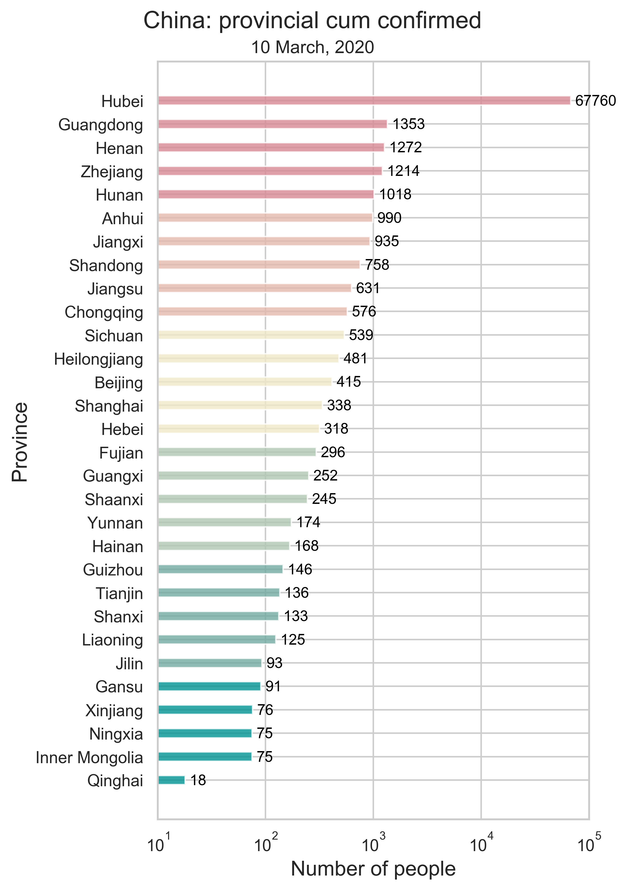



# [Fu Lab](https://fudab.github.io) 
## [COVID-19](https://fudab.github.io/covid-19)

## Effectiveness of Massive Travel Restrictions on Mitigating Outbreaks of COVID-19 in China.
### Xingru Chen, Xin Wang, Timmy Ma, Daniel Escudero and Feng Fu
`Last updated: May 11, 2020`

### COVID-19 Information

<table align="center">
  <tr>
    <th></th>
    <th></th>
  </tr>
  <tr>
    <td>(a) Infection number. </td>
    <td>(b) Infection rate. </td>
  </tr>
  <tr>
    <td></td>
    <td></td>
  </tr>
  <tr>
    <td>(c) Number of people cured. </td>
    <td>(d) Number of people dead. </td>
  </tr>
  <tr>
    <td colspan="2">Figure 1: The provincial level summary of COVID-19 by March 10, 2020 in China using bar charts. There are 30 individuals in total, consisting of 26 provinces and four municipalities. All corresponding numbers are marked at the end of the bars. We do not include imported cases in our data.</td>
  </tr>
</table>
