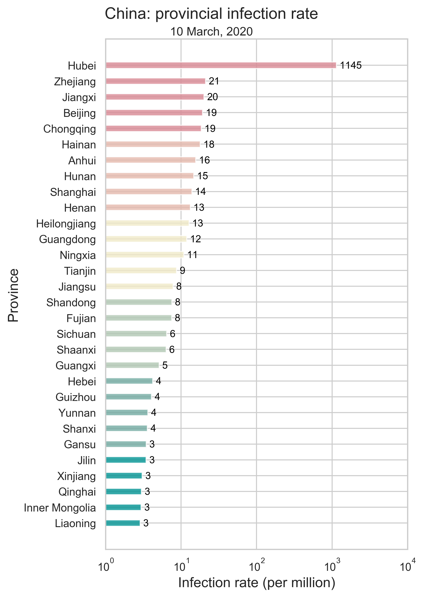
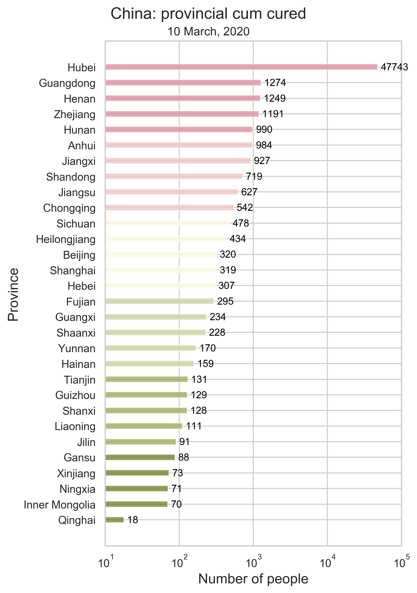
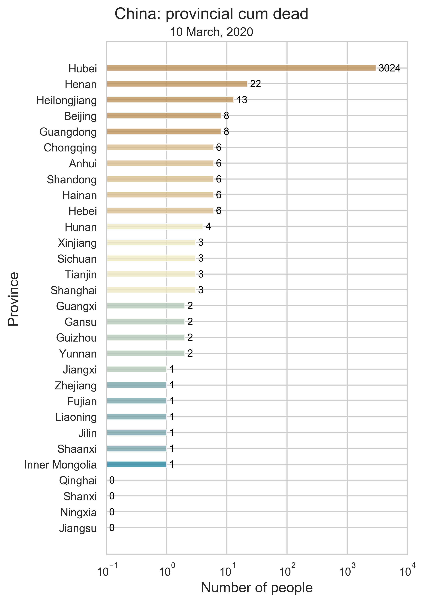



# [Fu Lab](https://fudab.github.io) 
## [COVID-19](https://fudab.github.io/covid-19)

## Effectiveness of Massive Travel Restrictions on Mitigating Outbreaks of COVID-19 in China.
### Xingru Chen, Xin Wang, Timmy Ma, Daniel Escudero and Feng Fu
`Last updated: May 11, 2020`

### COVID-19 Information

<table align="center">
  <tr>
    <th></th>
    <th></th>
  </tr>
  <tr>
    <td>(a) Infection number. </td>
    <td>(b) Infection rate. </td>
  </tr>
  <tr>
    <td></td>
    <td></td>
  </tr>
  <tr>
    <td>(c) Number of people cured. </td>
    <td>(d) Number of people dead. </td>
  </tr>
  <tr>
    <td colspan="2">Figure 1: The provincial level summary of COVID-19 by March 10, 2020 in China using bar charts. There are 30 individuals in total, consisting of 26 provinces and four municipalities. All corresponding numbers are marked at the end of the bars. We do not include imported cases in our data.</td>
  </tr>
</table>

### Migration Information

<table align="center">
<thead>
  <tr>
    <th><iframe src="https://fudab.github.io/covid-19/figures_china/China_heatmap_migration.html" width="900px" height="600px" scrolling="no" frameBorder="0"></iframe></th>
  </tr>
</thead>
<tbody>
  <tr>
    <td>(a) Migration traces involving the top 10 provinces with the greatest cumulative migration index from the epicenter Hubei.</td>
  </tr>
  <tr>
    <td align="center"><iframe src="https://fudab.github.io/covid-19/figures_china/China_heatmap_migration_c.html" width="900px" height="600px" scrolling="no" frameBorder="0"></iframe></td>
  </tr>
  <tr>
    <td>(b) Recursive migration traces involving the top 3 provinces with the greatest cumulative migration index from the departure provinces. </td>
  </tr>
  <tr>
    <td>Figure 2: Migration traces derived from the migration data. Daily migration index from January 1 to January 27 is added to obtain the cumulative index. And we use heatmap to indicate the number of infected people by January 27. For (b), the first place of departure is Hubei, which points to the 3 destinations: Guangdong, Henan and Hunan. These 3 destinations are treated as the new places of departure and new destinations are added. We repeat this process until there is no new destination appears.</td>
  </tr>
</tbody>
</table>
