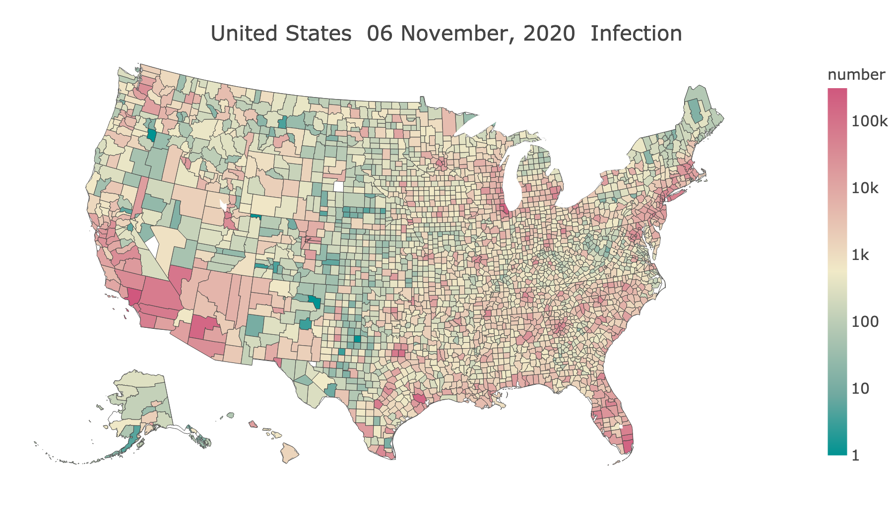



# [Fu Lab](https://fudab.github.io) 
## [COVID-19](https://fudab.github.io/covid-19)

## How the pandemic is influencing our life from every aspect
### Xingru Chen and Feng Fu
##### `Last updated: April 13, 2020`

### COVID-19 Information

* #### States and Counties

<table align="center">
  <tr>
    <th align="center"></th>
  </tr>
  <tr>
    <td>Figure 1: The spacial spread of COVID-19. We only include the 50 states as well as D.C. And those reported cases marked as 'Unknown' are not shown here.</td>
  </tr>
</table>

* #### Urban and Rural Areas

<table align="center">
  <tr>
    <th></th>
    <th></th>
  </tr>
  <tr>
    <td>(a) Number of infected people.</td>
    <td>(b) Percentage of infected people.</td>
  </tr>
  <tr>
    <td colspan="2">Figure 2: Comparing the risk of being infected in urban and rural areas. The definitions of an urbanized area, an urban cluster and a rural area are given by the Department of Aagriculture.</td>
  </tr>
</table>

* #### New England

<table align="center">
  <tr>
    <th align="center"></th>
  </tr>
  <tr>
    <td>Figure 3: Number of people infected in the six states of New England. The number given in the title of every panel indicates the total number of confirmed cases in that state by the time we update the data. We only show the top 6 counties which have the highest confirmed numbers for every state and the reported cases marked as 'Unknown' are not counted here. </td>
  </tr>
</table>

  *  ##### New Hampshire

<table align="center">
  <tr>
    <th align="center"></th>
  </tr>
  <tr>
    <td>Figure 4: Number of people infected in the counties of New Hampshire. The number given in the title of every panel is the number of confirmed cases in that county by the time we update the data. Both the cumulatived confirmed number and the new confirmed number are presented. </td>
  </tr>
</table>

### Mobility

<table align="center">
  <tr>
    <th align="center"></th>
  </tr>
  <tr>
    <td>Figure 5: Mobility in New Hampshire and the three states near it. We only show the top 6 counties which have the highest confirmed numbers for every state. </td>
  </tr>
</table>

### Correlation Between the Epidemic and the Stock Market

* #### S & P 500 Index

<table align="center">
  <tr>
    <th align="center"></th>
  </tr>
  <tr>
    <td>Figure 6: Number of people infected and the S & P 500 index. To aviod compressing of the curve due to different magnitudes, we use twin axis for the index.</td>
  </tr>
</table>

* #### Fortune 500 Companies and Zoom Video Communications

<table align="center">
  <tr>
    <th align="center"></th>
  </tr>
  <tr>
    <td>Figure 7: Number of people infected and the stock prices. We consider the Top 15 companies in the Fortune 500 list and also this most popular cloud-based videotelephony service.</td>
  </tr>
</table>

### Correlation Between Mobility and the Stock Market

* #### S & P 500 Index

<table align="center">
  <tr>
    <th align="center"></th>
  </tr>
  <tr>
    <td>Figure 8: Mobility and the S & P 500 index. Here we use the mobility index, which is a normalized value of the mobility. And we regard the sum of these values of all 50 states as the national mobility index. </td>
  </tr>
</table>

* #### Fortune 500 Companies and Zoom Video Communications

<table align="center">
  <tr>
    <th align="center"></th>
  </tr>
  <tr>
    <td>Figure 9: Mobility and the stock prices. We consider the Top 15 companies in the Fortune 500 list and also this most popular cloud-based videotelephony service. It seems that e-commerce (e.g Amazon) and pharmaceutical giants (e.g. UnitedHealth Group) are those least harmed by, or even benefit from the travel restriction. The stock price of Zoom surged to a record high at the very start, which may due to the warming up of online activities (e.g. meeting, teaching). However, this pattern did last for very long given that more and more security issues have been disclosed. </td>
  </tr>
</table>

