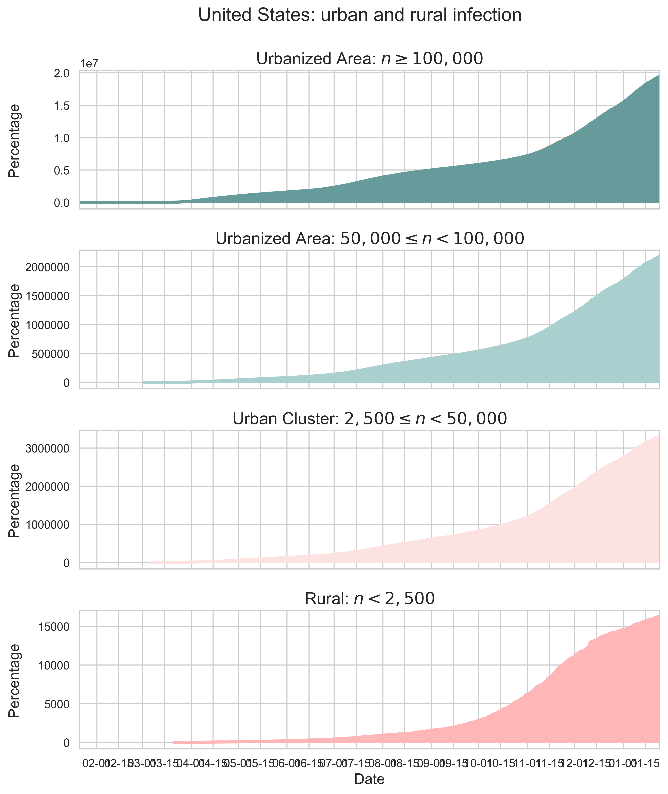
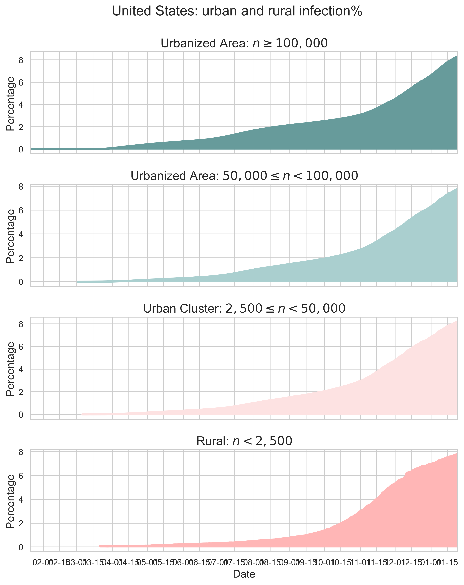
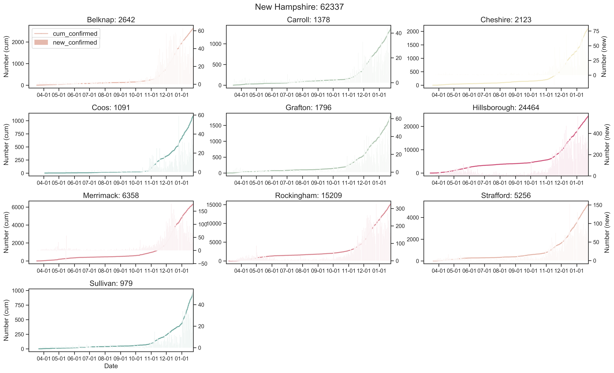
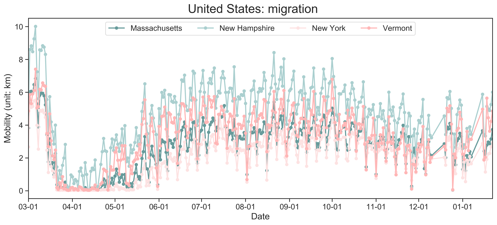
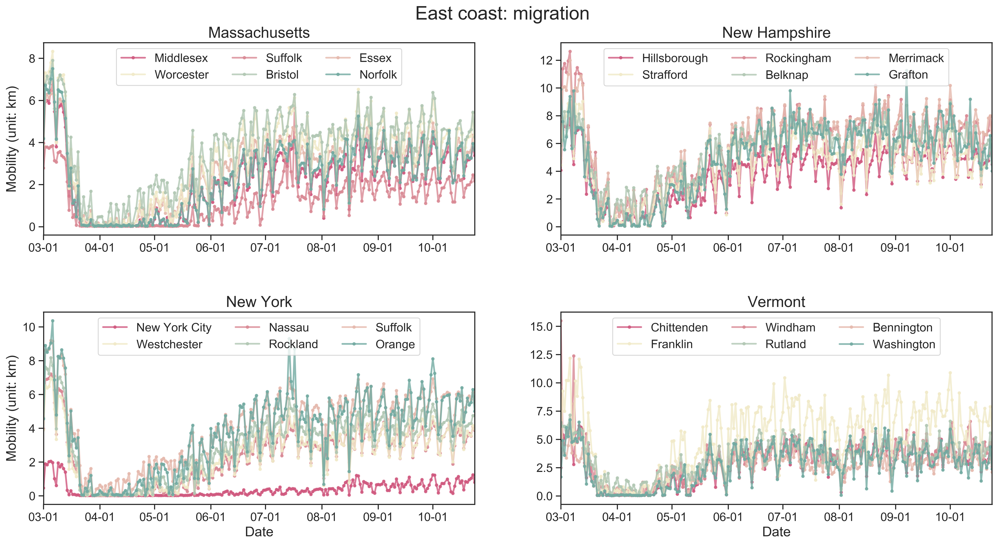
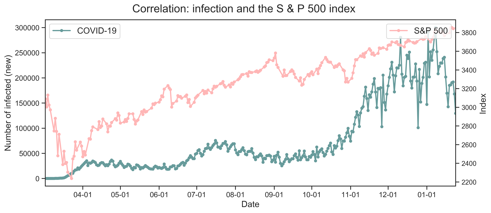
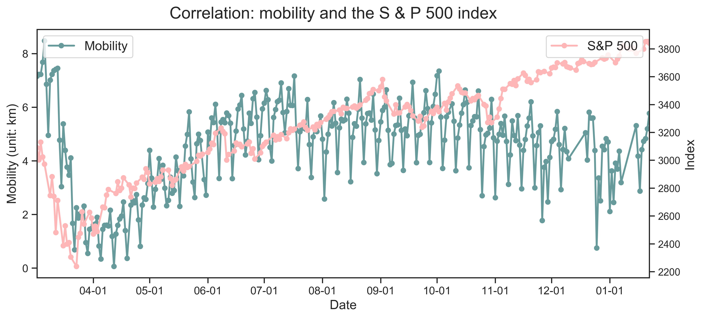



# [Fu Lab](https://fudab.github.io) 
## [COVID-19](https://fudab.github.io/covid-19)

## How the pandemic is influencing our life from every aspect
### Xingru Chen and Feng Fu
##### `Last updated: January 13, 2021`

### COVID-19 Information

* #### States and Counties

`States`

<table align="center">
  <tr>
    <th align="center"></th>
  </tr>
  <tr>
    <td>Figure 1: Daily new cases. We consider both the original data and the 7-day averages. The latest number of daily new cases in a state is given in the title of every panel. The color code corresponds to the partisan voting index (PVI) by each state.</td>
  </tr>
</table>  
  
<table>
  <tr align="center">
    <th rowspan="3"><iframe src="https://fudab.github.io/covid-19/figures_us/US_rose_death.html" width="460px" height="700px" scrolling="no" frameBorder="0"></iframe></th>
    <th><iframe src="https://fudab.github.io/covid-19/figures_us/US_map_death.html" width="450px" height="300px" scrolling="no" frameBorder="0"></iframe></th>
  </tr>
  <tr>
    <td>(b) The spatial casualty of COVID-19. The number of deaths is displayed on a logarithmic scale.</td>
  </tr>
  <tr>
    <td align="center"></td>
  </tr>
  <tr>
    <td>(a) The state level of reported deaths since the first reported death in United States in Jan 21, 2020.</td>
    <td>(c) The state level growth of confirmed deaths.</td>
  </tr>
  <tr>
    <td colspan="2">Figure 2: Summary of the COVID-19 death information as of January 12, 2021. For (c), the curve in a panel represents the number of cumulative deaths in the state and the histogram indicates the number of new deaths everyday. The color code in (a) and (c) corresponds to the partisan voting index (PVI) by each state.</td>
  </tr>
</table>

`Counties`
  
<table align="center">
  <tr>
    <th align="center"><iframe src="https://fudab.github.io/covid-19/figures_us_be/US_map_state.html" width="900px" height="500px" scrolling="no" frameBorder="0"></iframe></th>
  </tr>
  <tr>
    <td>(a) The county level infections in the United States. </td>
  </tr>
  <tr>
    <td align="center"><iframe src="https://fudab.github.io/covid-19/figures_us_be/US_map_state_death.html" width="900px" height="500px" scrolling="no" frameBorder="0"></iframe></td>
  </tr>
  <tr>
    <td>(b) The county level deaths in the United States. </td>
  </tr>
  <tr>
    <td>Figure 3: The country level spacial spread of COVID-19. We only include the 50 states as well as D.C. And those reported cases or deaths marked as from 'unknown' areas are not shown here.</td>
  </tr>
</table>

* #### Urban and Rural Areas

<table align="center">
  <tr>
    <th></th>
    <th></th>
  </tr>
  <tr>
    <td>(a) Number of people infected.</td>
    <td>(b) Percentage of people infected.</td>
  </tr>
  <tr>
    <td colspan="2">Figure 4: Comparing the risk of being infected in urban and rural areas. The definitions of an urbanized area, an urban cluster and a rural area are given by the Department of Aagriculture.</td>
  </tr>
</table>

* #### New England

<table align="center">
  <tr>
    <th align="center"></th>
  </tr>
  <tr>
    <td>Figure 5: Number of people infected in the six states of New England. The number given in the title of every panel indicates the total number of confirmed cases in that state by the time we update the data. We only show the top 6 counties which have the highest confirmed numbers for every state. </td>
  </tr>
</table>

*  #### New Hampshire

<table align="center">
  <tr>
    <th align="center"></th>
  </tr>
  <tr>
    <td>Figure 6: Number of people infected in the counties of New Hampshire. The number given in the title of every panel is the number of confirmed cases in that county by the time we update the data. Both the cumulatived confirmed number and the new confirmed number are presented. </td>
  </tr>
</table>

### Mobility

<table align = "center">
  <tr>
    <th><iframe src="https://fudab.github.io/covid-19/figures_us_be/US_map_mobility.html" width="450px" height="300px" scrolling="no" frameBorder="0"></iframe></th>
    <th><iframe src="https://fudab.github.io/covid-19/figures_us_be/US_map_mobility_index.html" width="450px" height="300px" scrolling="no" frameBorder="0"></iframe></th>
  </tr>
  <tr>
    <td>(a) State level mobility.</td>
    <td>(b) State level mobility index.</td>
  </tr>
  <tr>
    <td align = "center"><iframe src="https://fudab.github.io/covid-19/figures_us_be/US_map_state_mobility.html" width="450px" height="300px" scrolling="no" frameBorder="0"></iframe></td>
    <td align = "center"><iframe src="https://fudab.github.io/covid-19/figures_us_be/US_map_state_mobility_index.html" width="450px" height="300px" scrolling="no" frameBorder="0"></iframe></td>
  </tr>
  <tr>
    <td>(c) County level mobility.</td>
    <td>(d) County level mobility index.</td>
  </tr>
  <tr>
    <td colspan="2">Figure 7: Geographical distribution of mobility (real value) and mobility index (ratio to the base line). We use log scale for panel (c) and (d). </td>
  </tr>
</table>

<table align="center">
  <tr>
    <th align="center"></th>
  </tr>
  <tr>
    <td>(a) State level mobility.</td>
  </tr>
  <tr>
    <td align="center"></td>
  </tr>
  <tr>
    <td>(b) State level mobility index.</td>
  </tr>
  <tr>
    <td>Figure 8: State level mobility information. We consider both the original data and the 7-day averages. The latest value or ratio of a state is given in the title of every panel. The color code corresponds to the partisan voting index (PVI) by each state.</td>
  </tr>
</table>  

<table align="center">
  <tr>
    <th align="center"></th>
  </tr>
  <tr>
    <td>Figure 9: Mobility in New Hampshire and the three states near it. We only show the top 6 counties which have the highest confirmed numbers for every state. </td>
  </tr>
</table>

### Correlation Between the Epidemic and Mobility

<table align="center">
  <tr>
    <th align="center"></th>
  </tr>
  <tr>
    <td>Figure 10: 7-day average of the number of daily new cases and the mobility index. The color code corresponds to the partisan voting index (PVI) by each state.</td>
  </tr>
</table> 

### Correlation Between the Epidemic and the Stock Market

* #### S & P 500 Index

<table align="center">
  <tr>
    <th align="center"></th>
  </tr>
  <tr>
    <td>Figure 11: Number of people infected and the S & P 500 index. To aviod compressing of the curve due to different magnitudes, we use twin axis for the index.</td>
  </tr>
</table>

* #### Fortune 500 Companies and Zoom Video Communications

<table align="center">
  <tr>
    <th align="center"></th>
  </tr>
  <tr>
    <td>Figure 12: Number of people infected and the stock prices. We consider the Top 15 companies in the Fortune 500 list and also this most popular cloud-based videotelephony service.</td>
  </tr>
</table>

### Correlation Between Mobility and the Stock Market

* #### S & P 500 Index

<table align="center">
  <tr>
    <th align="center"></th>
  </tr>
  <tr>
    <td>Figure 13: Mobility and the S & P 500 index. Here we use the mobility index, which is a normalized value of the mobility. And we regard the sum of these values of all 50 states as the national mobility index. </td>
  </tr>
</table>

* #### Fortune 500 Companies and Zoom Video Communications

<table align="center">
  <tr>
    <th align="center"></th>
  </tr>
  <tr>
    <td>Figure 14: Mobility and the stock prices. We consider the Top 15 companies in the Fortune 500 list and also this most popular cloud-based videotelephony service. It seems that e-commerce (e.g Amazon) and pharmaceutical giants (e.g. UnitedHealth Group) are those least harmed by, or even benefit from the travel restriction. The stock price of Zoom surged to a record high at the very start, which may due to the warming up of online activities (e.g. online meeting and online school). However, this pattern did not last for very long given that more and more security issues of the software have been disclosed. </td>
  </tr>
</table>

