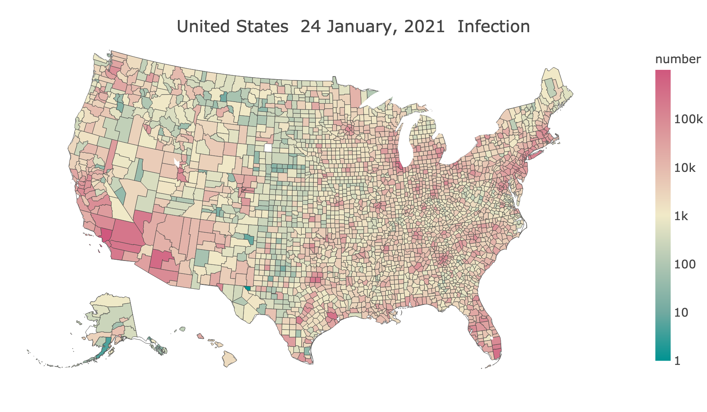



# [Fu Lab](https://fudab.github.io) 
## [COVID-19](https://fudab.github.io/covid-19)

## How the pandemic is influencing our life from every aspect
### Xingru Chen and Feng Fu
##### `Last updated: April 13, 2020`

### COVID-19 Information

#### States and Counties

<table align="center">
  <tr>
    <th align="center"></th>
  </tr>
  <tr>
    <td>Figure 1: The spacial spread of COVID-19. We only include the 50 states as well as D.C. And those reported cases marked as 'Unknown' are not counted here.</td>
  </tr>
</table>

#### Urban and Rural Areas

<table align="center">
  <tr>
    <th></th>
    <th></th>
  </tr>
  <tr>
    <td>(a) Number of infected people.</td>
    <td>(b) Percentage of infected people.</td>
  </tr>
  <tr>
    <td colspan="2">Figure 2: Comparing the risk of being infected in urban and rural areas. The definitions of an urbanized area, an urban cluster and a rural area are given by the Department of Aagriculture.</td>
  </tr>
</table>

#### New England

<table align="center">
  <tr>
    <th align="center"></th>
  </tr>
  <tr>
    <td>Figure 3: Number of people infected in the six states of New England. The number given in the title of every panel indicates the total number of confirmed cases in that state by the time we update the data. We only show the top 6 counties which have the highest confirmed numbers for every state and the reported cases marked as 'Unknown' are not counted here. </td>
  </tr>
</table>

##### New Hampshire

<table align="center">
  <tr>
    <th align="center"></th>
  </tr>
  <tr>
    <td>Figure 4: Number of people infected in the counties of New Hampshire. The number given in the title of every panel is the number of confirmed cases in that county by the time we update the data. Both the cumulatived confirmed number and the new confirmed number are presented. </td>
  </tr>
</table>

