

# [Fu Lab](https://fudab.github.io) 
## [COVID-19](https://fudab.github.io/covid-19)

## ATC
### Xingru Chen and Feng Fu
##### `Last updated: July 9, 2020`

* This report provides preliminary results and is work in progress.
* Original code and data are in the [Github Repository](https://github.com/fudab/COVID-19-ATC).

### About
> ATC stands for all things considered. The report offers all sorts of knowledge about COVID-19 from different perspectives.
### Data
> The data we use in our research consist of three parts: the COVID-19 infection information, world population prospects and other information.

#### Data Source
* COVID-19 information: [Johns Hopkins COVID-19 Warehouse](https://github.com/CSSEGISandData/COVID-19)
* World population prospects: [United Nations Department of Economic and Social Affairs Population Dynamics](https://population.un.org/wpp/Download/Standard/CSV/)
* Rule of law survey results: [World Justice Project Rule of Law Index](https://worldjusticeproject.org/rule-of-law-index/factors/2020)

### Data Processing

* The JHU COVID-19 data include the number of confirmed, recovered and dead cases of more than 180 countries and regions.

<table align="center">
  <tr>
    <th>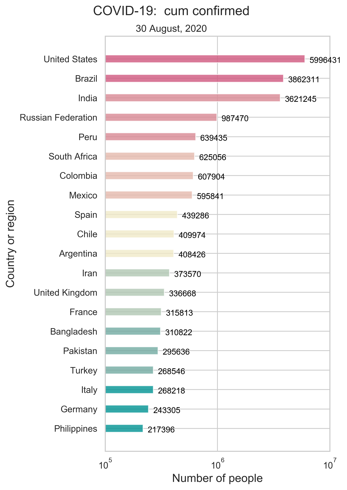</th>
    <th></th>
    <th></th>
  </tr>
  <tr>
    <td>(a) Cumulative number of confirmed cases. </td>
    <td>(b) Cumulative number of recovered cases. </td>
    <td>(c) Cumulative deaths. </td>
  </tr>
  <tr>
    <td align="center">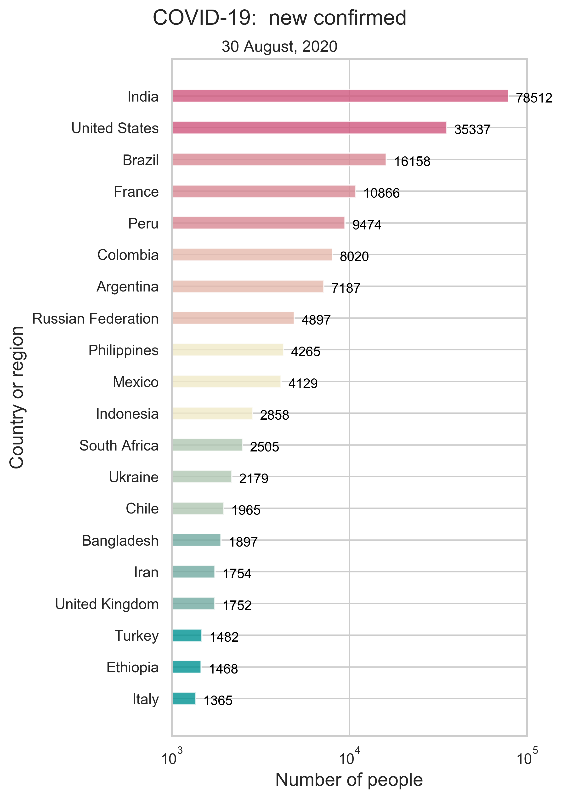</td>
    <td align="center">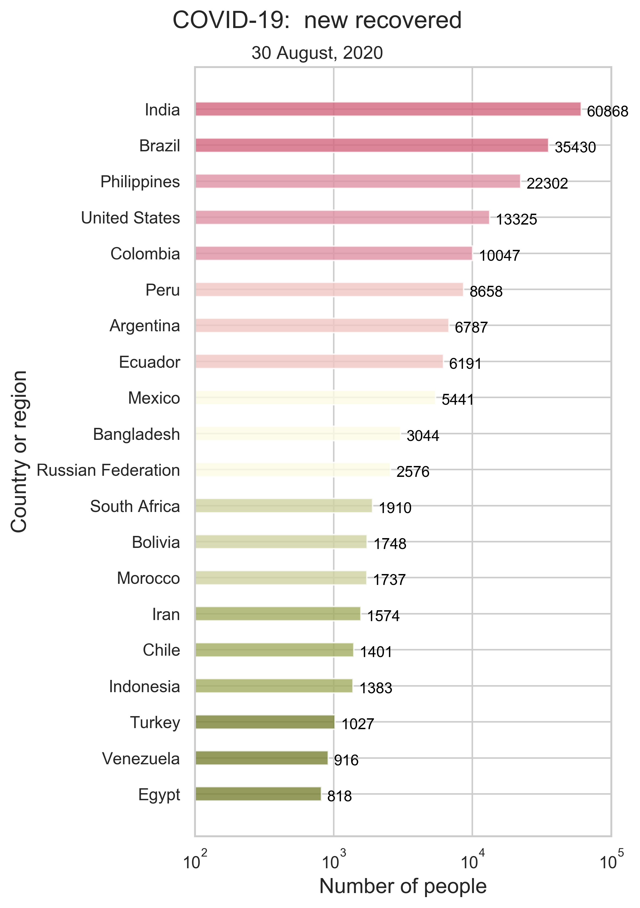</td>
    <td align="center">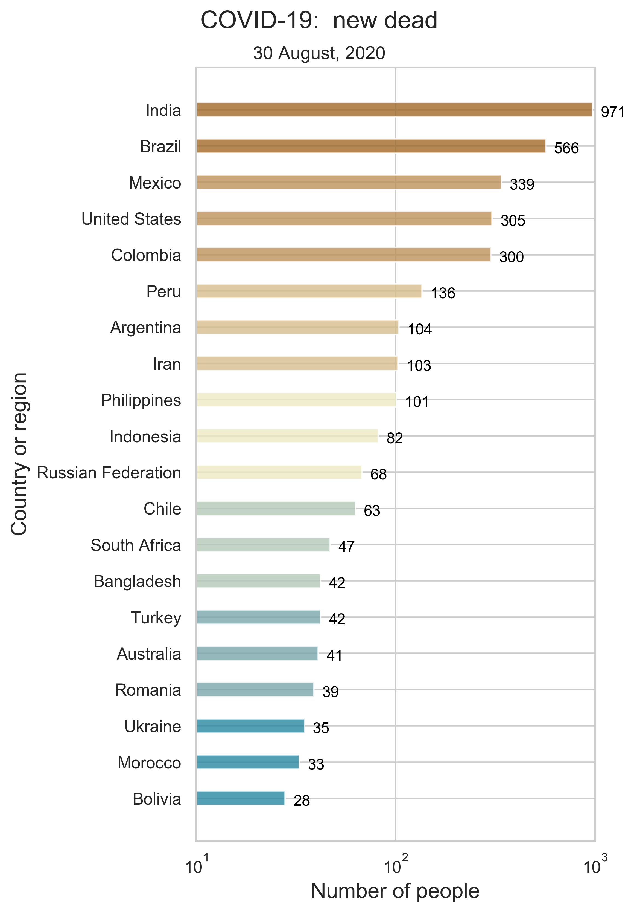</td>
  </tr>
  <tr>
    <td>(d) Daily new confirmed cases. </td>
    <td>(e) Daily new recovered cases. </td>
    <td>(f) Daily new deaths. </td>
  </tr>
  <tr>
    <td colspan="3">Figure 1: Summary of the world-wide COVID-19 information as of the date updated. We only show the top 20 countries or regions on every panel. </td>
  </tr>
</table>

<table align="center">
  <tr>
    <th><iframe src="https://fudab.github.io/covid-19/figures_rule_of_law/World_heatmap_cum_confirmed.html" width="450px" height="270px" scrolling="no" frameBorder="0"></iframe></th>
    <th><iframe src="https://fudab.github.io/covid-19/figures_rule_of_law/World_heatmap_new_confirmed.html" width="450px" height="270px" scrolling="no" frameBorder="0"></iframe></th>
  </tr>
  <tr>
    <td>(a) Spatial spread of COVID-19 (cumulative).</td>
    <td>(b) Spatial spread of COVID-19 (daily new).</td>
  </tr>
  <tr>
    <td colspan="2">Figure 2: Geographical distribution of the epidemic. Here, we consider both the cumulative number of confiremd cases and the daily new cases. </td>
  </tr>
</table>

<table align="center">
  <tr>
    <th></th>
  </tr>
  <tr>
    <td>Figure 3: National infection rate as of the date updated. We only show the top 20 countries or regions with the highest incidence rate. </td>
  </tr>
</table>

* The UN Population Dynamics data include the population sizes of more than 470 countries and regions.

<table align="center">
  <tr>
    <th align="center"><iframe src="https://fudab.github.io/covid-19/figures_rule_of_law/World_heatmap_population.html" width="800px" height="480px" scrolling="no" frameBorder="0"></iframe>
</th>
  </tr>
  <tr>
    <td>Figure 3: Geographical distribution of world population. We round up the population sizes to 2 decimal places for a clear presentation of the data.</td>
  </tr>
</table>

* The WJP Rule of Law Index data include the scores and rankings of more than 120 countries. There are eight factors and 44 sub-factors in total.

<table>
  <tr>
    <th colspan="2">factor</th>
    <th colspan="2">subfactor</th>
  </tr>
  <tr>
    <td rowspan="6">1</td>
    <td rowspan="6">Constraints on Government Powers</td>
    <td>1.1</td>
    <td>Government powers are effectively limited by the legislature</td>
  </tr>
  <tr>
    <td>1.2</td>
    <td>Government powers are effectively limited by the judiciary</td>
  </tr>
  <tr>
    <td>1.3</td>
    <td>Government powers are effectively limited by independent auditing and review</td>
  </tr>
  <tr>
    <td>1.4</td>
    <td>Government officials are sanctioned for misconduct</td>
  </tr>
  <tr>
    <td>1.5</td>
    <td>Government powers are subject to non-governmental checks</td>
  </tr>
  <tr>
    <td>1.6</td>
    <td>Transition of power is subject to the law</td>
  </tr>
  <tr>
    <td rowspan="4">2</td>
    <td rowspan="4">Absence of Corruption</td>
    <td>2.1</td>
    <td>Government officials in the executive branch do not use public office for private gain</td>
  </tr>
  <tr>
    <td>2.2</td>
    <td>Government officials in the judicial branch do not use public office for private gain</td>
  </tr>
  <tr>
    <td>2.3</td>
    <td>Government officials in the police and the military do not use public office for private gain</td>
  </tr>
  <tr>
    <td>2.4</td>
    <td>Government officials in the legislative branch do not use public office for private gain</td>
  </tr>
  <tr>
    <td rowspan="4">3</td>
    <td rowspan="4">Open Government</td>
    <td>3.1</td>
    <td>Publicized laws and government data</td>
  </tr>
  <tr>
    <td>3.2</td>
    <td>Right to information</td>
  </tr>
  <tr>
    <td>3.3</td>
    <td>Civic participation</td>
  </tr>
  <tr>
    <td>3.4</td>
    <td>Complaint mechanisms</td>
  </tr>
  <tr>
    <td rowspan="8">4</td>
    <td rowspan="8">Fundamental Rights</td>
    <td>4.1</td>
    <td>Equal treatment and absence of discrimination</td>
  </tr>
  <tr>
    <td>4.2</td>
    <td>The right to life and security of the person is effectively guaranteed</td>
  </tr>
  <tr>
    <td>4.3</td>
    <td>Due process of the law and rights of the accused</td>
  </tr>
  <tr>
    <td>4.4</td>
    <td>Freedom of opinion and expression is effectively guaranteed</td>
  </tr>
  <tr>
    <td>4.5</td>
    <td>Freedom of belief and religion is effectively guaranteed</td>
  </tr>
  <tr>
    <td>4.6</td>
    <td>Freedom from arbitrary interference with privacy is effectively guaranteed</td>
  </tr>
  <tr>
    <td>4.7</td>
    <td>Freedom of assembly and association is effectively guaranteed</td>
  </tr>
  <tr>
    <td>4.8</td>
    <td>Fundamental labor rights are effectively guaranteed</td>
  </tr>
  <tr>
    <td rowspan="3">5</td>
    <td rowspan="3">Order and Security</td>
    <td>5.1</td>
    <td>Crime is effectively controlled</td>
  </tr>
  <tr>
    <td>5.2</td>
    <td>Civil conflict is effectively limited</td>
  </tr>
  <tr>
    <td>5.3</td>
    <td>People do not resort to violence to redress personal grievances</td>
  </tr>
  <tr>
    <td rowspan="5">6</td>
    <td rowspan="5">Regulatory Enforcement</td>
    <td>6.1</td>
    <td>Government regulations are effectively enforced</td>
  </tr>
  <tr>
    <td>6.2</td>
    <td>Government regulations are applied and enforced without improper influence</td>
  </tr>
  <tr>
    <td>6.3</td>
    <td>Administrative proceedings are conducted without unreasonable delay</td>
  </tr>
  <tr>
    <td>6.4</td>
    <td>Due process is respected in administrative proceedings</td>
  </tr>
  <tr>
    <td>6.5</td>
    <td>The government does not expropriate without lawful process and adequate compensation</td>
  </tr>
  <tr>
    <td rowspan="7">7</td>
    <td rowspan="7">Civil Justice</td>
    <td>7.1</td>
    <td>People can access and afford civil justice</td>
  </tr>
  <tr>
    <td>7.2</td>
    <td>Civil justice is free of discrimination</td>
  </tr>
  <tr>
    <td>7.3</td>
    <td>Civil justice is free of corruption</td>
  </tr>
  <tr>
    <td>7.4</td>
    <td>Civil justice is free of improper government influence</td>
  </tr>
  <tr>
    <td>7.5</td>
    <td>Civil justice is not subject to unreasonable delay</td>
  </tr>
  <tr>
    <td>7.6</td>
    <td>Civil justice is effectively enforced</td>
  </tr>
  <tr>
    <td>7.7</td>
    <td>Alternative dispute resolution mechanisms are accessible, impartial, and effective</td>
  </tr>
  <tr>
    <td rowspan="7">8</td>
    <td rowspan="7">Criminal Justice</td>
    <td>8.1</td>
    <td>Criminal investigation system is effective</td>
  </tr>
  <tr>
    <td>8.2</td>
    <td>Criminal adjudication system is timely and effective</td>
  </tr>
  <tr>
    <td>8.3</td>
    <td>Correctional system is effective in reducing criminal behavior</td>
  </tr>
  <tr>
    <td>8.4</td>
    <td>Criminal system is impartial</td>
  </tr>
  <tr>
    <td>8.5</td>
    <td>Criminal system is free of corruption</td>
  </tr>
  <tr>
    <td>8.6</td>
    <td>Criminal system is free of improper government influence</td>
  </tr>
  <tr>
    <td>8.7</td>
    <td>Due process of the law and rights of the accused</td>
  </tr>
  <tr>
    <td colspan="4">Table: The WJP Rule of Law Index factors and subfactors.</td>
  </tr>
</table>

<table align="center">
  <tr>
    <th align="center"><iframe src="https://fudab.github.io/covid-19/figures_rule_of_law/World_heatmap_overall.html" width="800px" height="480px" scrolling="no" frameBorder="0"></iframe>
</th>
  </tr>
  <tr>
    <td>Figure 4: Geographical distribution of the WJP Rule of Law Index (overall score). We round up the scores to 2 decimal places for a clear presentation of the data.</td>
  </tr>
</table>

### Method

To explore whether the degree to which a country is autocratic affects its ability to respond to the pandemic, we consider the correlation between infection rate and rule of law index.

Given the number of people infected and the population size of every country, we can calculate the incidence rate as of the date the data of COVID-19 is updated. Regarding it as the dependent variable, we perform first the simple linear regression with model function

 \begin{equation}
  y = \beta x + \alpha,
 \end{equation}

  

where we take either the overall score or one of the 8 factors as our independent variable. And the `Pearson's correlation coefficient` is calculated:

 \begin{equation}
  \rho_{X, Y} = \frac{\text{cov}(X, Y)}{\sigma_X\sigma_Y}.
 \end{equation}

  

Further, we consider the multivariate linear regression with model function

 \begin{equation}
  y = \displaystyle\sum_{i = 1}^m \beta_i x_i + \beta_0.
 \end{equation}

 

Here, the dependent variables are either the 8 factors or the 44 subfactors altogether and hence $m = 8$ or $m = 44$. The `Root Mean Squared Error (RMSE)` is calculated:

 \begin{equation}
  \text{RMSE} = \sqrt{\frac{1}{n}\displaystyle\sum_{j = 1}^n(\hat{y}_j - y_j)^2},
 \end{equation}

 
where $n$ is the size of the dataset. In our example, $n$ is the number of countries and regions offered.

### Discussion

### Correlation between the rule of law index and infection rate

* Simple linear regression

<table align="center">
  <tr>
    <th>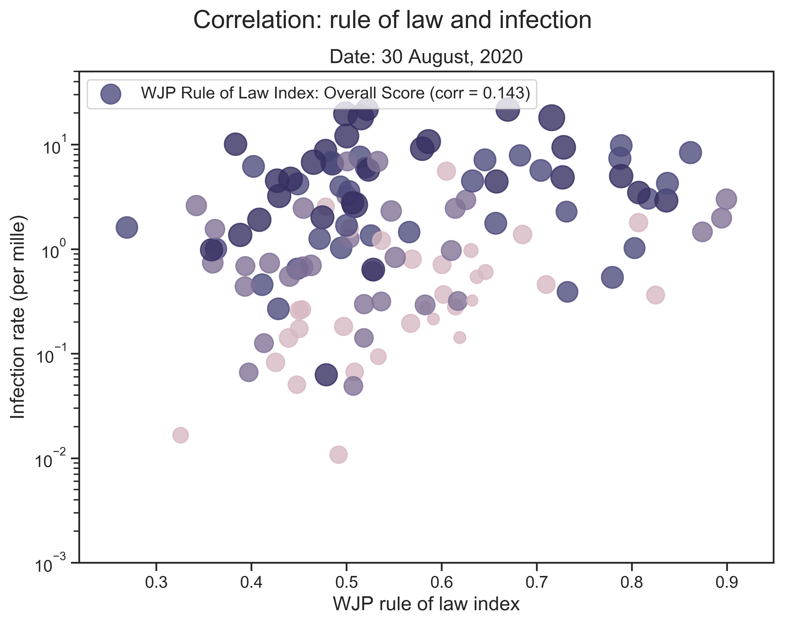</th>
    <th>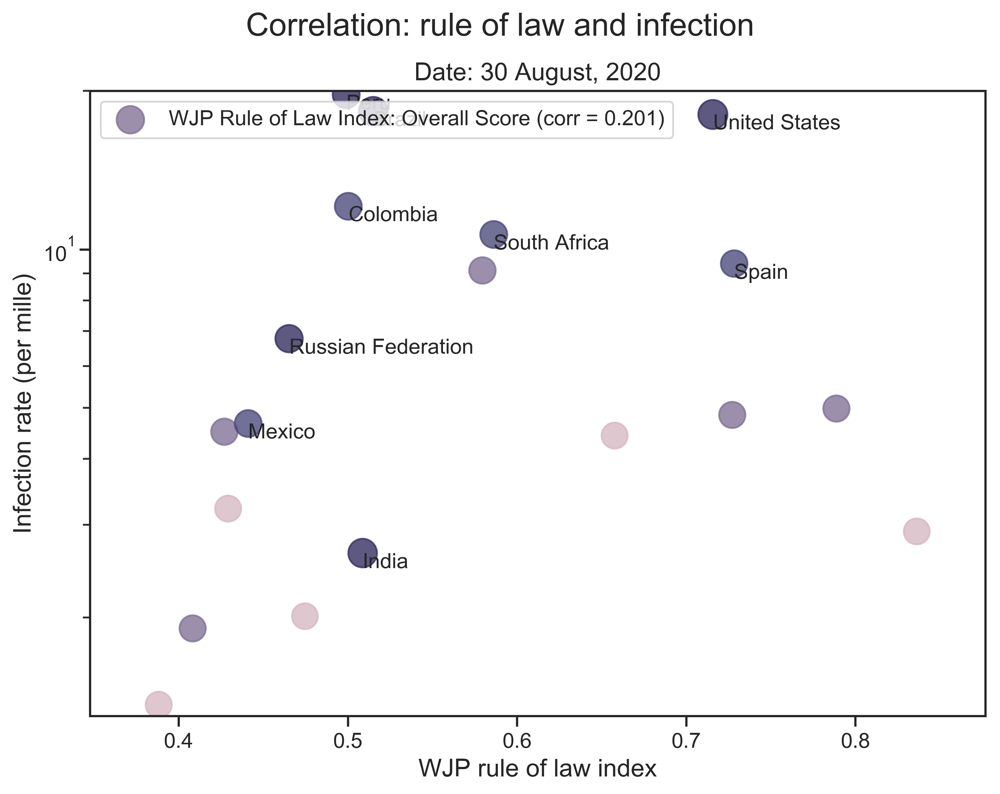</th>
  </tr>
  <tr>
    <td>(a) Correlation between the overall score and the infection rate (all countries). </td>
    <td>(b) Correlation between the overall score and the infection rate（selected countries).  </td>
  </tr>
  <tr>
    <td colspan="2">Figure 5: Correlation between the overall score and the infection rate. The Pearson coefficents are given for both (a) and (b). In (b), We only take into account the 20 countires that have been most affected by the pandemic (with the greatest number of cumulative confirmed cases so far). Among them, the top 10 countries are marked. We use log scale for the y-axis.</td>
  </tr>
</table>

<table align="center">
  <tr>
    <th>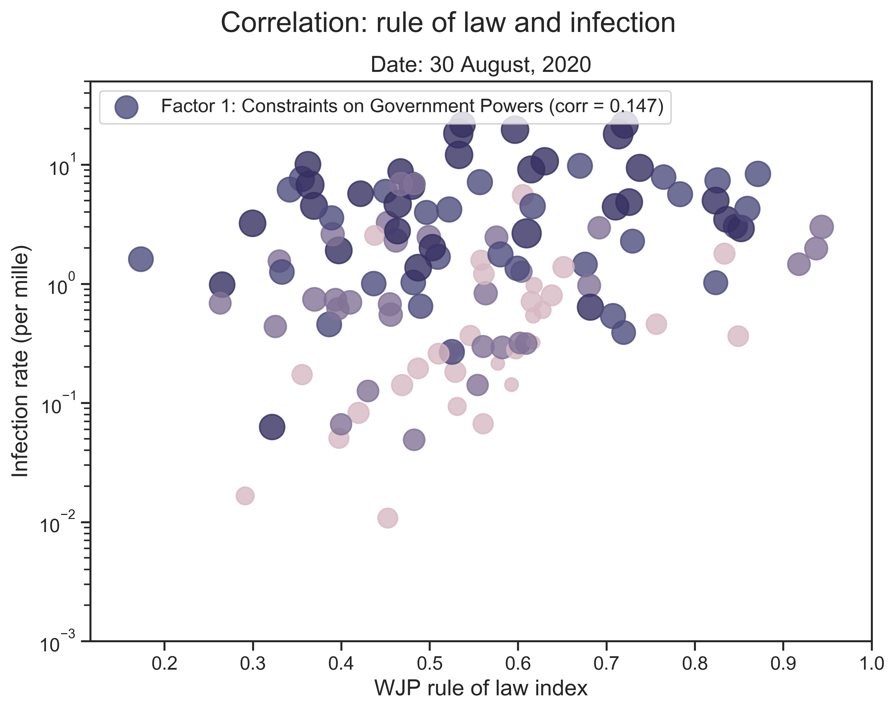</th>
    <th>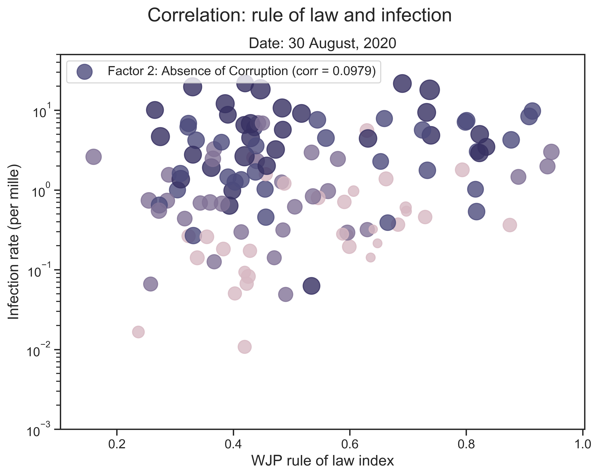</th>
    <th>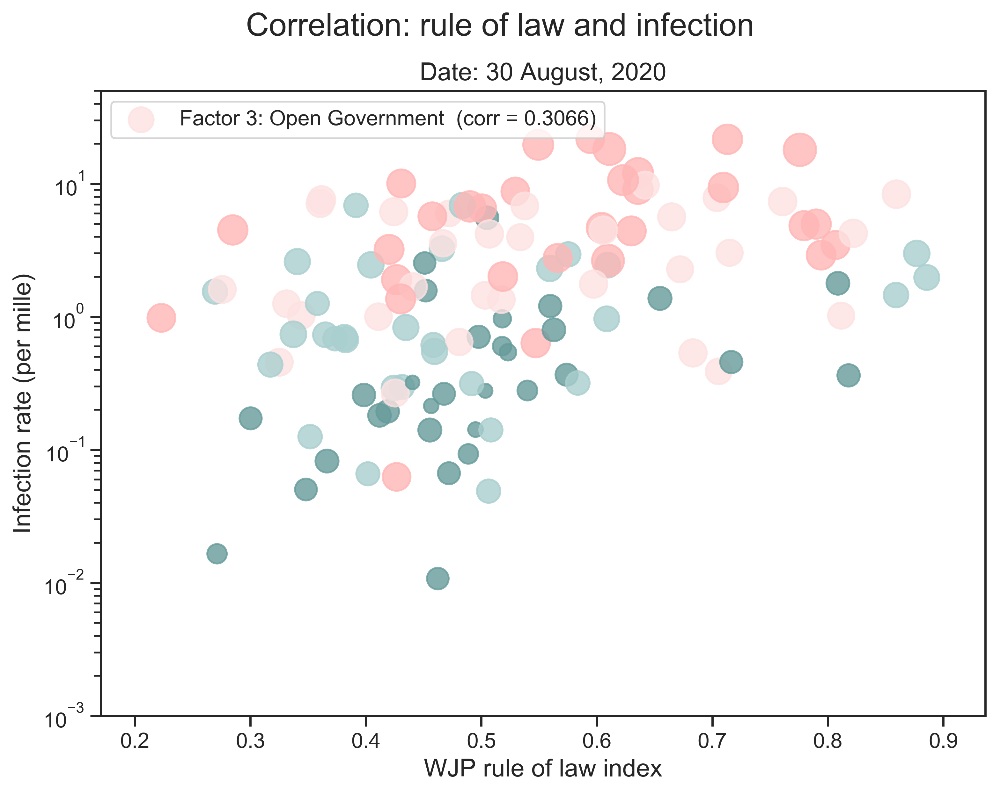</th>
    <th>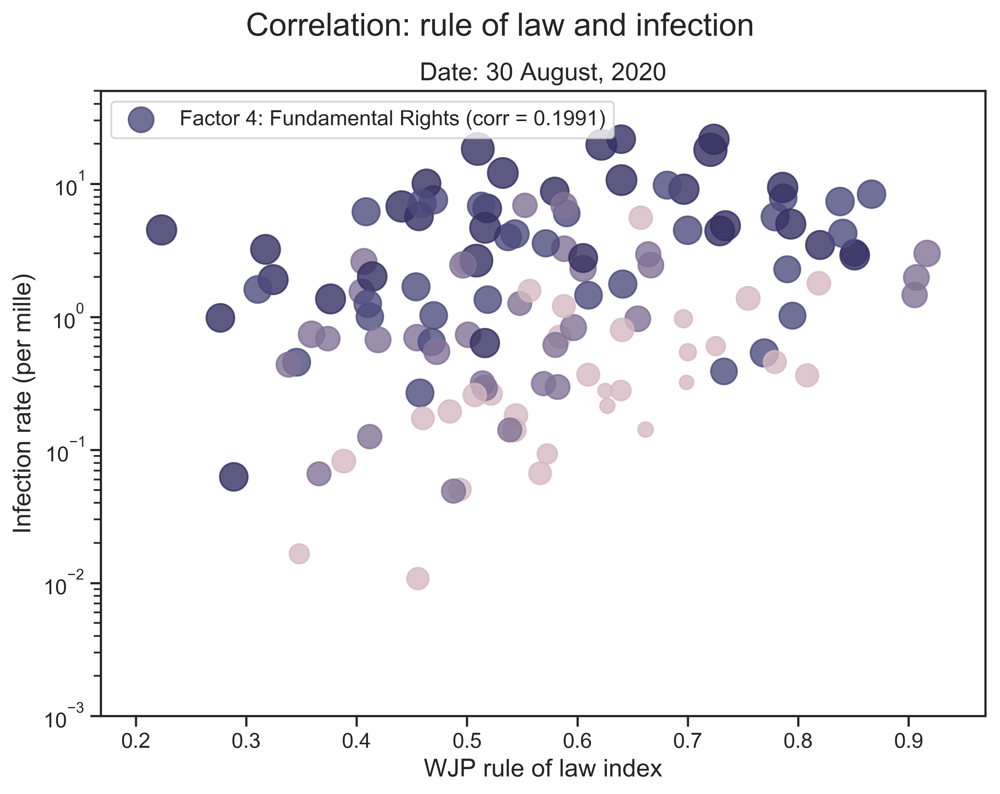</th>
  </tr>
  <tr>
    <td>(a) The score of the 1st factor and the infection rate. </td>
    <td>(b) The score of the 2nd factor and the infection rate.</td>
    <td>(c) The score of the 3rd factor and the infection rate.</td>
    <td>(d) The score of the 4th factor and the infection rate.</td>
  </tr>
  <tr>
    <td align="center">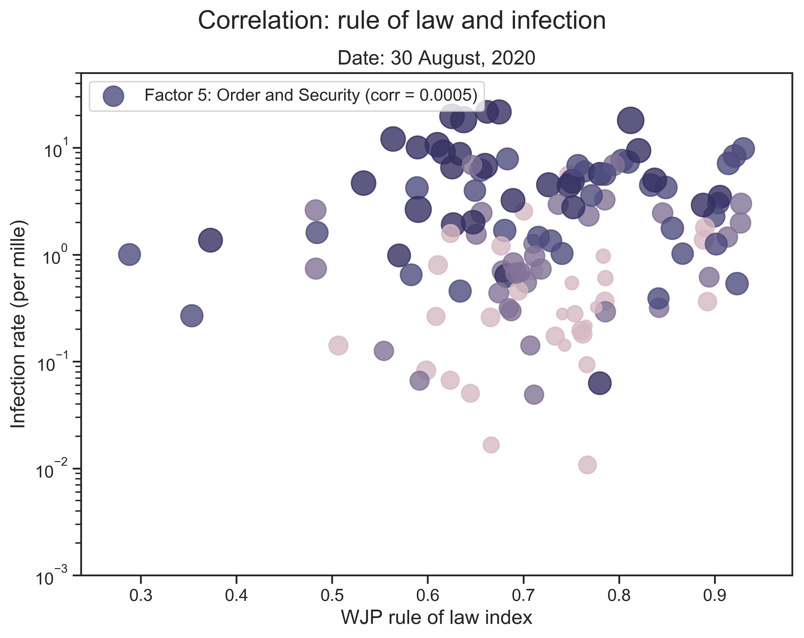</td>
    <td align="center">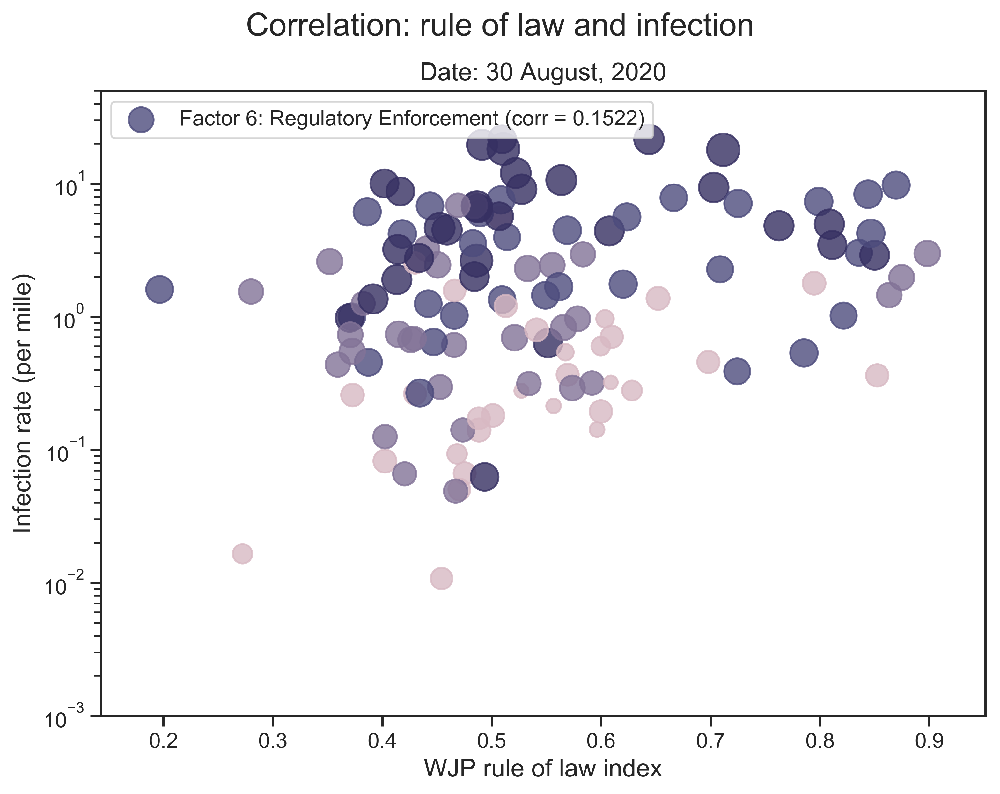</td>
    <td align="center"></td>
    <td align="center"></td>
  </tr>
  <tr>
    <td>(e) The score of the 5th factor and the infection rate.</td>
    <td>(f) The score of the 6th factor and the infection rate.</td>
    <td>(g) The score of the 7th factor and the infection rate.</td>
    <td>(h) The score of the 8th factor and the infection rate.</td>
  </tr>
  <tr>
    <td colspan="4">Figure 5: Correlation between the score of a single factor and the infection rate. We go through all 8 factors and the one with the highest correlation coeffecient is highlighted. </td>
  </tr>
</table>

* Multivariate linear regression

<table align="center">
  <tr>
    <th colspan="2">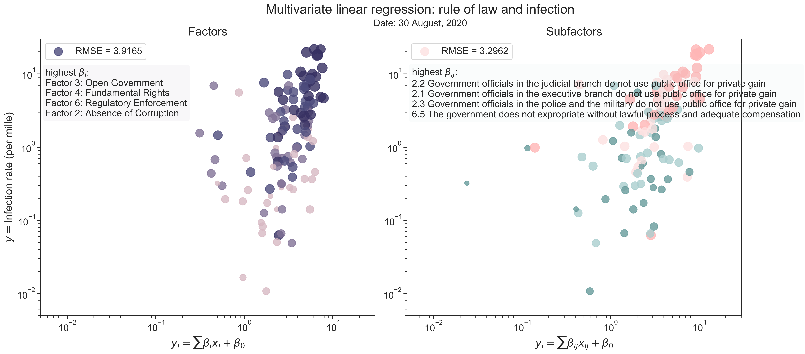</th>
  </tr>
  <tr>
    <td>(a) A linear combination of factors' scores and the infection rate.</td>
    <td>(b) A linear combination of subfactors' score and the infection rate.</td>
  </tr>
  <tr>
    <td colspan="2">Figure 6: Correlation between the scores of factors or subfactors and the infection rate. We mark the four factors or subfactors with the highest coefficents. </td>
  </tr>
</table>

