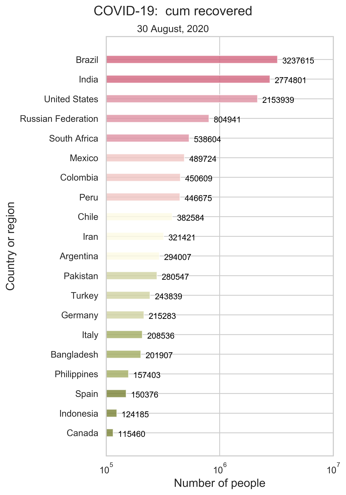
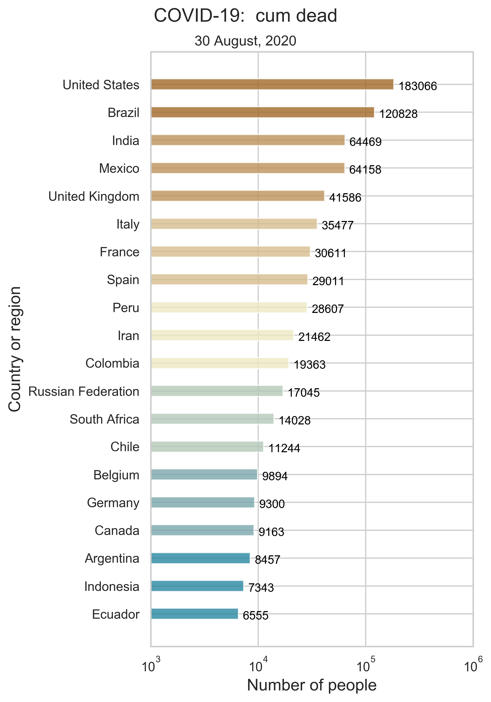
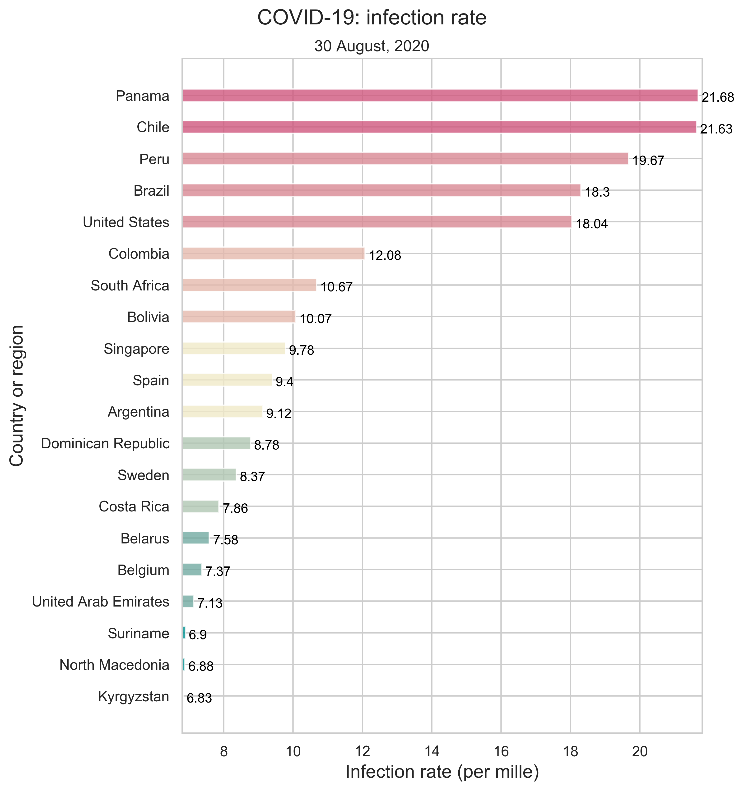



# [Fu Lab](https://fudab.github.io) 
## [COVID-19](https://fudab.github.io/covid-19)

## ATC
### Xingru Chen and Feng Fu
##### `Last updated: May 4, 2020`

* This report provides preliminary results and is work in progress.
* Original code and data are in the [Github Repository](https://github.com/fudab/COVID-19-ATC).

### About
> ATC stands for all things considered. The report offers all sorts of knowledge about COVID-19 from different perspectives.
### Data
> The data we use in our research consist of three parts: the COVID-19 infection information, world population prospects and other information.

#### Data Source
* COVID-19 information: [Johns Hopkins COVID-19 Warehouse](https://github.com/CSSEGISandData/COVID-19)
* World population prospects: [United Nations Department of Economic and Social Affairs Population Dynamics](https://population.un.org/wpp/Download/Standard/CSV/)
* Rule of law survey results: [World Justice Project Rule of Law Index](https://worldjusticeproject.org/rule-of-law-index/factors/2020)

### Data Processing

* The JHU COVID-19 data include the number of confirmed, recovered and dead cases of more than 180 countries and regions.

<table align="center">
  <tr>
    <th></th>
    <th></th>
  </tr>
  <tr>
    <td>(a) Cumulative number of confirmed cases. </td>
    <td>(b) Daily new confirmed cases. </td>
  </tr>
  <tr>
    <td align="center"></td>
    <td align="center"></td>
  </tr>
  <tr>
    <td>(c) Cumulative number of recovered cases. </td>
    <td>(d) Daily new recovered cases. </td>
  </tr>
  <tr>
    <td></td>
    <td></td>
  </tr>
  <tr>
    <td>(e) Cumulative deaths. </td>
    <td>(f) Daily new deaths. </td>
  </tr>
  <tr>
    <td colspan="2">Figure 1: Summary of the world-wide COVID-19 information as of the date updated. We only show the top 20 countries(regions) on every panel. </td>
  </tr>
</table>

<table align="center">
  <tr>
    <th></th>
  </tr>
  <tr>
    <td>Figure 2: National infection rate as of the date updated. We only show the top 20 countries(regions) with the highest incidence rate. </td>
  </tr>
</table>

<iframe src="https://fudab.github.io/covid-19/figures_rule_of_law/render" height="200" width="300"></iframe>
<iframe src="./figures_rule_of_law/render.html" width="300" height="200" style="float:right"></iframe>

<table align="center">
  <tr>
    <th></th>
  </tr>
  <tr>
    <td>Figure 3:  </td>
  </tr>
</table>

* The UN Population Dynamics data include the population sizes of more than 470 countries and regions.

* The WJP Rule of Law Index data include the scores and rankings of more than 120 countries. There are eight factors and 44 sub-factors in total.

<table>
  <tr>
    <th colspan="2">factor</th>
    <th colspan="2">subfactor</th>
  </tr>
  <tr>
    <td rowspan="6">1</td>
    <td rowspan="6">Constraints on Government Powers</td>
    <td>1.1</td>
    <td>Government powers are effectively limited by the legislature</td>
  </tr>
  <tr>
    <td>1.2</td>
    <td>Government powers are effectively limited by the judiciary</td>
  </tr>
  <tr>
    <td>1.3</td>
    <td>Government powers are effectively limited by independent auditing and review</td>
  </tr>
  <tr>
    <td>1.4</td>
    <td>Government officials are sanctioned for misconduct</td>
  </tr>
  <tr>
    <td>1.5</td>
    <td>Government powers are subject to non-governmental checks</td>
  </tr>
  <tr>
    <td>1.6</td>
    <td>Transition of power is subject to the law</td>
  </tr>
  <tr>
    <td rowspan="4">2</td>
    <td rowspan="4">Absence of Corruption</td>
    <td>2.1</td>
    <td>Government officials in the executive branch do not use public office for private gain</td>
  </tr>
  <tr>
    <td>2.2</td>
    <td>Government officials in the judicial branch do not use public office for private gain</td>
  </tr>
  <tr>
    <td>2.3</td>
    <td>Government officials in the police and the military do not use public office for private gain</td>
  </tr>
  <tr>
    <td>2.4</td>
    <td>Government officials in the legislative branch do not use public office for private gain</td>
  </tr>
  <tr>
    <td rowspan="4">3</td>
    <td rowspan="4">Open Government</td>
    <td>3.1</td>
    <td>Publicized laws and government data</td>
  </tr>
  <tr>
    <td>3.2</td>
    <td>Right to information</td>
  </tr>
  <tr>
    <td>3.3</td>
    <td>Civic participation</td>
  </tr>
  <tr>
    <td>3.4</td>
    <td>Complaint mechanisms</td>
  </tr>
  <tr>
    <td rowspan="8">4</td>
    <td rowspan="8">Fundamental Rights</td>
    <td>4.1</td>
    <td>Equal treatment and absence of discrimination</td>
  </tr>
  <tr>
    <td>4.2</td>
    <td>The right to life and security of the person is effectively guaranteed</td>
  </tr>
  <tr>
    <td>4.3</td>
    <td>Due process of the law and rights of the accused</td>
  </tr>
  <tr>
    <td>4.4</td>
    <td>Freedom of opinion and expression is effectively guaranteed</td>
  </tr>
  <tr>
    <td>4.5</td>
    <td>Freedom of belief and religion is effectively guaranteed</td>
  </tr>
  <tr>
    <td>4.6</td>
    <td>Freedom from arbitrary interference with privacy is effectively guaranteed</td>
  </tr>
  <tr>
    <td>4.7</td>
    <td>Freedom of assembly and association is effectively guaranteed</td>
  </tr>
  <tr>
    <td>4.8</td>
    <td>Fundamental labor rights are effectively guaranteed</td>
  </tr>
  <tr>
    <td rowspan="3">5</td>
    <td rowspan="3">Order and Security</td>
    <td>5.1</td>
    <td>Crime is effectively controlled</td>
  </tr>
  <tr>
    <td>5.2</td>
    <td>Civil conflict is effectively limited</td>
  </tr>
  <tr>
    <td>5.3</td>
    <td>People do not resort to violence to redress personal grievances</td>
  </tr>
  <tr>
    <td rowspan="5">6</td>
    <td rowspan="5">Regulatory Enforcement</td>
    <td>6.1</td>
    <td>Government regulations are effectively enforced</td>
  </tr>
  <tr>
    <td>6.2</td>
    <td>Government regulations are applied and enforced without improper influence</td>
  </tr>
  <tr>
    <td>6.3</td>
    <td>Administrative proceedings are conducted without unreasonable delay</td>
  </tr>
  <tr>
    <td>6.4</td>
    <td>Due process is respected in administrative proceedings</td>
  </tr>
  <tr>
    <td>6.5</td>
    <td>The government does not expropriate without lawful process and adequate compensation</td>
  </tr>
  <tr>
    <td rowspan="7">7</td>
    <td rowspan="7">Civil Justice</td>
    <td>7.1</td>
    <td>People can access and afford civil justice</td>
  </tr>
  <tr>
    <td>7.2</td>
    <td>Civil justice is free of discrimination</td>
  </tr>
  <tr>
    <td>7.3</td>
    <td>Civil justice is free of corruption</td>
  </tr>
  <tr>
    <td>7.4</td>
    <td>Civil justice is free of improper government influence</td>
  </tr>
  <tr>
    <td>7.5</td>
    <td>Civil justice is not subject to unreasonable delay</td>
  </tr>
  <tr>
    <td>7.6</td>
    <td>Civil justice is effectively enforced</td>
  </tr>
  <tr>
    <td>7.7</td>
    <td>Alternative dispute resolution mechanisms are accessible, impartial, and effective</td>
  </tr>
  <tr>
    <td rowspan="7">8</td>
    <td rowspan="7">Criminal Justice</td>
    <td>8.1</td>
    <td>Criminal investigation system is effective</td>
  </tr>
  <tr>
    <td>8.2</td>
    <td>Criminal adjudication system is timely and effective</td>
  </tr>
  <tr>
    <td>8.3</td>
    <td>Correctional system is effective in reducing criminal behavior</td>
  </tr>
  <tr>
    <td>8.4</td>
    <td>Criminal system is impartial</td>
  </tr>
  <tr>
    <td>8.5</td>
    <td>Criminal system is free of corruption</td>
  </tr>
  <tr>
    <td>8.6</td>
    <td>Criminal system is free of improper government influence</td>
  </tr>
  <tr>
    <td>8.7</td>
    <td>Due process of the law and rights of the accused</td>
  </tr>
  <tr>
    <td colspan="4">Table: The WJP Rule of Law Index factors and subfactors.</td>
  </tr>
</table>

### Method

### Discussion

### Correlation between infection rate and rule of law
> the degree to which a country is autocratic affects its ability to respond to the pandemic

