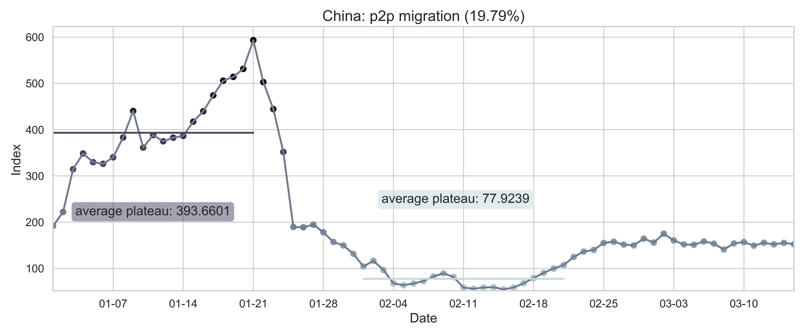
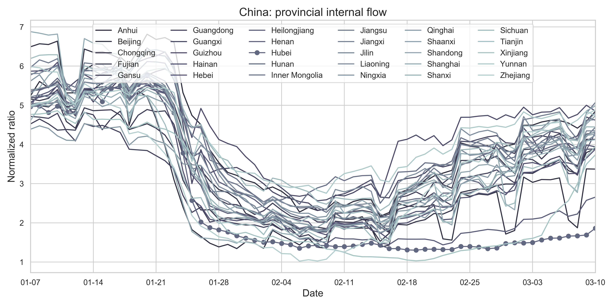



# [Fu Lab](https://fudab.github.io) 
## [COVID-19](https://fudab.github.io/covid-19)

## Effectiveness of Massive Travel Restrictions on Mitigating Outbreaks of COVID-19 in China.
### Xingru Chen, Xin Wang, Timmy Ma, Daniel Escudero and Feng Fu
`Last updated: May 1, 2020`
* This report provides preliminary results and is work in progress.
* More detailed results and figures are in the [Bag End](https://fudab.github.io/covid-19/bag_end_china).
* Original code and data are in the [Github Repository](https://github.com/fudab/China-COVID-19-mobility).

### Abstract
> In the very early stage of an unprecedented outbreak of COVID-19 started in the epicenter, Wuhan, Hubei Province, China, the Chinese government imposed by far the largest scale of strict travel restrictions on more than 11 million people (beyond) on January 23, 2020, amid the busiest period of the year for domestic travels (chunyun, travels made during the Lunar New Year). Such massive travel restrictions have caused dramatic reduction in travel volume, not only for the outflow from Wuhan (Hubei), but also nationwide. Control measures like this helps reduce the number of imported cases to other provinces, which can possibly slowdown the onset of epidemic outbreaks in other regions and potentially weaken the impact of the disease. Here, we are interested in estimating the effectiveness of such massive travel restrictions in the mitigation of disease impact using a data driven approach.

### Data
> The data we use in our research consist of three parts: the COVID-19 infection information, the census, as well as the migration information in China. We consider the data in a provincial level where 26 provinces as well as four municipalities are treated as individual compartments. The start date is `January 15, 2020` and the end date is `March 10, 2020`.

#### Data Source
* COVID-19 information: 
[DXY DX Doctor Global Pandemic Real Time Report](https://ncov.dxy.cn/ncovh5/view/en_pneumonia?from=dxy&source=&link=&share=)
[National Health Commission of PRC Daily Report](http://www.nhc.gov.cn/xcs/xxgzbd/gzbd_index.shtml)
* census:[China Census Bureau](http://www.chamiji.com)
* migration information: [Baidu Qianxi](https://qianxi.baidu.com)

#### Data Processing

 <table class="tg">
  <tr>
    <th align="center"></th>
    <th align="center" rowspan="3"></th>
  </tr>
  <tr>
    <td class="tg-cly1">(a) The national level of reported cases since the first 41 reported cases in Hubei Province in Jan 15, 2020.</td>
  </tr>
  <tr>
    <td align="center"></td>
  </tr>
  <tr>
    <td class="tg-cly1">(b) The spacial spread of COVID-19. The five provinces with the highest number of infections are marked on the map. </td>
    <td class="tg-cly1">(c) The provincial level growth of confirmed cases. The curve in a panel represents the number of cumulative infected people in the province and the histogram indicates the number of new infected people everyday.</td>
  </tr>
  <tr>
    <td colspan="2">Figure 1: Summary of the COVID-19 information as of May 10, 2020. To reduce errors, we have removed all imported cases from other countries. The color code in (c) corresponds to the severity of the epidemic.</td>
  </tr>
 </table>

<table align="center">
  <tr>
    <th></th>
    <th></th>
  </tr>
  <tr>
    <td>(a) The sum of province to province migration index in China.</td>
    <td>(d) The nationwide normalized internal-flow ratio in China. </td>
  </tr>
  <tr>
    <td align="center"></td>
    <td align="center"></td>
  </tr>
  <tr>
    <td>(b) The sum of p2p migration index in Hubei Province (destination). </td>
    <td>(e) The province level normalized internal-flow ratio in Hubei Province. </td>
  </tr>
  <tr>
    <td align="center"></td>
    <td align="center"></td>
  </tr>
  <tr>
    <td>(c) The sum of p2p migration index in Hubei Province (place of departure). </td>
    <td>(f) The city level inter-flow ratio in Wuhan City. </td>
  </tr>
  <tr>
    <td colspan="2"></td>
  </tr>
  <tr>
    <td colspan="2">(g) The province level normalized internal-flow ratios in China. The cruve of Hubei Province is highlighted with scatters.</td>
  </tr>
  <tr>
    <td colspan="2">Figure 2: Summary of the migration infromation in China, Hubei province and Wuhan city. The time period for calculating the first average plateau value is from January 1, 2020 to January 21, 2020 and that for calculating the second value is from February 1, 2020 to February 21, 2020. For panels (a) - (f), the percentage in the title indicates the after-to-before ratio.</td>
  </tr>
</table>

### Method

#### SEIR Model
We consider an SEIR model in a population structure for every province. The systems of ODEs describe the dynnamics in continuous time t, that is, days since the outbreak of the disease:

 \begin{equation}
  \begin{cases}
  \displaystyle \frac{dS_i(t)}{dt} & =  -\beta_i(t) S_i(t) \frac{I_i(t)}{N_i(t)} - \displaystyle\sum_{j, j\neq i}\alpha_{ij}(t)S_i(t) + \sum_{j, j\neq i} \alpha_{ji}(t)S_j(t), \\
  \displaystyle \frac{dE_i(t)}{dt} & =  \beta_i(t) S_i(t)  \frac{I_i(t)}{N_i(t)} - \sigma_i(t) E_i(t) - \displaystyle\sum_{j, j\neq i}\alpha_{ij}(t)E_i(t) + \sum_{j, j\neq i} \alpha_{ji}(t)E_j(t), \\
  \displaystyle \frac{dI_i(t)}{dt} & =  \sigma_i(t) E_i(t) - \gamma_i(t) I_i(t), \\
  \displaystyle \frac{dR_i(t)}{dt} & =  \gamma_i(t) I_i(t). \\
\end{cases}
 \end{equation}

Here, the subscript $i$ refers to the $i$th compartment on the provincial level (in other words, the $i$th province) and $N_i(t) = S_i(t) + E_i(t) + I_i(t) + R_i(t)$ is the population size of compartment $i$. 

To parameterize migration flows between compartments, we use the real provincial level mobility data from [Baidu Qianxi](https://qianxi.baidu.com). Notice that the number of infected cases of the epidemic and the population size of a same province differ by at least three orders of magnitude (see [Bag End](https://fudab.github.io/covid-19/bag_end_china) for details). Hence $S_i(t) + E_i(t)$ is roughly $N_i(t)$ and we can assume the following two identities:

\begin{equation}
\begin{cases}
\displaystyle\sum_{j, j\neq i}\alpha_{ij}(t) \left[S_i(t) + E_i(t) \right] &\approx \displaystyle\sum_{j, j\neq i}\alpha_{ij}(t)N_i(t) = \theta \displaystyle\sum_{j, j\neq i}m_{ij}, \\
\displaystyle\sum_{j, j\neq i} \alpha_{ji}(t) \left[S_j(t) + E_j(t) \right] & \approx \displaystyle\sum_{j, j\neq i} \alpha_{ji}(t)N_j(t) = \theta \displaystyle\sum_{j, j\neq i}m_{ji}.
\end{cases}
 \end{equation}

Here, $\theta$ is the unit of p2p migration index.

With the above approximation, we can estimate $\alpha_{ij}(t)$ by $\frac{\theta m_{ij}(t)}{N_i(t)}$. A simplified version of the original system of equations is thus obtained:

\begin{equation}
\begin{cases}
\displaystyle \frac{dS_i(t)}{dt} & =  -\beta_i(t) S_i(t) \frac{I_i(t)}{N_i(t)} - \theta\displaystyle\sum_{j, j\neq i}\frac{ m_{ij}(t)}{N_i(t)}S_i(t) + \theta\sum_{j, j\neq i} \frac{m_{ji}(t)}{N_j(t)}S_j(t), \\
\displaystyle \frac{dE_i(t)}{dt} & =  \beta_i(t) S_i(t)  \frac{I_i(t)}{N_i(t)} - \sigma_i(t) E_i(t) - \theta \displaystyle\sum_{j, j\neq i}\frac{m_{ij}(t)}{N_i(t)}E_i(t) + \theta\sum_{j, j\neq i}\frac{ m_{ji}(t)}{N_j(t)}E_j(t),  \\
\displaystyle \frac{dI_i(t)}{dt} & =  \sigma_i(t) E_i(t) - \gamma_i(t) I_i(t), \\
\displaystyle \frac{dR_i(t)}{dt} & =  \gamma_i(t) I_i(t).
\end{cases}
\end{equation}

In general, all three parameters can be time dependent, due to containment efforts (social distancing). Since time $t$ is discrete in practice, we treat these parameters as piecewise functions, of which every piece is a constant. To simplify the problem, we unify the timeline for all provinces. As mentioned above, the record of the COVID-19 information starts from `January 15` and is truncated to `March 10`. Therefore, the variable $t$ in the ODE system satisfies $t \in [0, 55]$. In our model, we focus more on the infection rate and the function $\beta_i(t)$ is split into twelve pieces while $\sigma_i(t)$ is split into three pieces and same for $\gamma$:

\begin{equation}
\beta_i(t) = 
  \begin{cases}
  \displaystyle \beta_{ij}, & 3(j - 1) \leq t \leq 3j - 1, \,\,\, \text{for} \,\,\, 1 \leq j \leq  7 \\ 
  \beta_{i(7 + j)}, & 21 + 7(j - 1) \leq t \leq 21 + 7j - 1, \,\,\, \text{for} \,\,\, 1 \leq j \leq 5 
\end{cases}
\end{equation}

\begin{equation}
\sigma_i(t) = 
  \begin{cases}
  \displaystyle \sigma_{i1}, & 0 \leq t \leq 5 \\
  \displaystyle \sigma_{i2}, & 6 \leq t \leq 11 \\
  \displaystyle \sigma_{i3}. & 12 \leq t \leq 55 
\end{cases}
\end{equation}

### Parameter Estimation

#### Prior
Before we include the migration from one compartment to another, we can first consider the independent SEIR model without migration for every province:

 \begin{equation}
  \begin{cases}
  \displaystyle \frac{dS_i(t)}{dt} =  -\beta_i(t) S_i(t) \frac{I_i(t)}{N_i}, \\
  \displaystyle \frac{dE_i(t)}{dt} =  \beta_i(t) S_i(t)  \frac{I_i(t)}{N_i} - \sigma_i(t) E_i(t), \\
  \displaystyle \frac{dI_i(t)}{dt} =  \sigma_i(t) E_i(t) - \gamma_i(t) I_i(t), \\
  \displaystyle \frac{dR_i(t)}{dt} =  \gamma_i(t) I_i(t). \\
\end{cases}
 \end{equation}

To obtain a satisfactory estimation of the epidemic parameters for the $i$th province, we apply the `dual annealing` algorithm to perform a nonlinear least square fitting of the variable $R_i(t)$ and find the global minimum value of the residual. The table below shows an ordered dictionary of all the parameter objects required.

<table align="center">
  <tr>
    <th>name</th>
    <th>initial value</th>
    <th>lower bound</th>
    <th>upper bound</th>
    <th>expression</th>
  </tr>
  <tr>
    <td align="center">$N_i$</td>
    <td align="center">$n_i$</td>
    <td align="center"></td>
    <td align="center"></td>
    <td align="center"></td>
  </tr>
  <tr>
    <td align="center">$S_i(0)$</td>
    <td align="center"></td>
    <td align="center"></td>
    <td align="center"></td>
    <td align="center">$N_i - E_i(0) - I_i(0) - R_i(0)$</td>
  </tr>
  <tr>
    <td align="center">$E_i(0)$</td>
    <td align="center">50</td>
    <td align="center">0</td>
    <td align="center">500</td>
    <td align="center"></td>
  </tr>
  <tr>
    <td align="center">$I_i(0)$</td>
    <td align="center">50</td>
    <td align="center">0</td>
    <td align="center">200</td>
    <td align="center"></td>
  </tr>
  <tr>
    <td align="center">$R_i(0)$</td>
    <td align="center">0</td>
    <td align="center">0</td>
    <td align="center">100</td>
    <td align="center"></td>
  </tr>
  <tr>
    <td align="center">$\beta_{ij}$</td>
    <td align="center">0.5</td>
    <td align="center">0.01</td>
    <td align="center">1</td>
    <td align="center"></td>
  </tr>
  <tr>
    <td align="center">$\sigma_{ij}$</td>
    <td align="center">0.5</td>
    <td align="center">0.05</td>
    <td align="center">0.5</td>
    <td align="center"></td>
  </tr>
  <tr>
    <td align="center">$\gamma_{ij}$</td>
    <td align="center">0.5</td>
    <td align="center">0.05</td>
    <td align="center">0.5</td>
    <td align="center"></td>
  </tr>
 <tr>
    <td colspan="5">Table 1: Implementation of parameters according to the sampling of the estimates for epidemic parameters. Here, $n_i$ is the population size of province $i$.</td>
  </tr>
</table>

#### Posterior

After obtaining the prior estimation of the parameters for every province, we can further calculate the covariance matrix $\text{cov}(\hat{x})$ and therefore the lower and upper bounds of these estimated values of parameters. The covariance matrix contains complete information about the uncertainty of the parameter estimators. The method we apply here to obtain it is to use a linear approximation method through estimation of the Jacobian matrix $F$ of the parameter estimation problem:

\begin{equation}
 \text{cov}(\hat{x}) = s^2(F'F)^{-1}, \qquad \text{with}\, F = \left. \frac{\partial f(x)}{\partial x}\right|_{x = \hat{x}}.
\end{equation}

Here $s^2$ is the unbiased estimation of the variance $\sigma^2$ obtained from the residuals of the parameter estimation:

\begin{equation}
 s^2 = \frac{S_\text{min}(r, \hat{x})}{(n - p)N},
\end{equation}

where $n$ is the total number of measurements, $p$ is the number of estimated parameters, $n - p$ is the degrees of freedom, and $N$ is the size of the population. Meanwhile, $S_\text{min}(r, \hat{x}) = \displaystyle\sum(r - R(\hat{x}))$ is just the minimum objective function value.

The covariance matrix is a square matrix with $p\times p$ dimensions. In particular, the diagonal elements are the variances of the corresponding ordered parameters (namely, the square root of the $k$th diagonal element is the standard error of the $k$th parameter). Following a student $t$-distribution, the confidence interval at $(1 - 2\alpha)$ significance is:

\begin{equation}
\hat{x}_{1 - 2\alpha} = \hat{x} \pm t_{n - p}^{\alpha}\sqrt{\text{diag}\,\text{cov}(\hat{x})}.
\end{equation}

By letting $\alpha = 0.005$, we can obtain the $99.99\%$ confidence intervals of the parameters for every province. Still, we would like to guarantee that the lower and upper bounds of the epidemic parameters are consistent with the sampling of estimations and also the lower bounds of $E_i(0)$, $I_i(0)$ as well as $R_i(0)$ are non-negative. Combining the above restrictions, we get the updated bounds for the parameters, which are ready for the simulation with migration where a system of $30 \times 4$ equations will be in operation.

<table align="center">
  <tr>
    <th>name</th>
    <th>initial value</th>
    <th>lower bound</th>
    <th>upper bound</th>
    <th>expression</th>
  </tr>
  <tr>
    <td align="center">$N_i(0)$</td>
    <td align="center">$n_i$</td>
    <td align="center"></td>
    <td align="center"></td>
    <td align="center"></td>
  </tr>
  <tr>
    <td align="center">$S_i(0)$</td>
    <td align="center"></td>
    <td align="center"></td>
    <td align="center"></td>
    <td align="center">$N_i - E_i(0) - I_i(0) - R_i(0)$</td>
  </tr>
  <tr>
    <td align="center">$E_i(0)$</td>
    <td align="center">$E_i^{\text{prior}}(0)$</td>
    <td align="center">0</td>
    <td align="center">$\max(500, E_i^{\text{upper}}(0))$</td>
    <td align="center"></td>
  </tr>
  <tr>
    <td align="center">$I_i(0)$</td>
    <td align="center">$I_i^{\text{prior}}(0)$</td>
    <td align="center">0</td>
    <td align="center">$\max(200, I_i^{\text{upper}}(0))$</td>
    <td align="center"></td>
  </tr>
  <tr>
    <td align="center">$R_i(0)$</td>
    <td align="center">$R_i^{\text{prior}}(0)$</td>
    <td align="center">0</td>
    <td align="center">$\max(100, R_i^{\text{upper}}(0))$</td>
    <td align="center"></td>
  </tr>
  <tr>
    <td align="center">$\beta_{ij}$</td>
    <td align="center">$\beta_{ij}^{\text{prior}}$</td>
    <td align="center">0.01</td>
    <td align="center">$\min(1, \beta_{ij}^{\text{upper}})$</td>
    <td align="center"></td>
  </tr>
  <tr>
    <td align="center">$\sigma_{ij}$</td>
    <td align="center">$\sigma_{ij}^{\text{prior}}$</td>
    <td align="center">0.05</td>
    <td align="center">$\min(0.5, \sigma_{ij}^{\text{upper}})$</td>
    <td align="center"></td>
  </tr>
  <tr>
    <td align="center">$\gamma_{ij}$</td>
    <td align="center">$\gamma_{ij}^{\text{prior}}$</td>
    <td align="center">0.05</td>
    <td align="center">$\min(0.5, \gamma_{ij}^{\text{upper}})$</td>
    <td align="center"></td>
  </tr>
 <tr>
    <td colspan="5">Table 2: Implementation of parameters according to the sampling of the estimates for epidemic parameters and the prior result. Here, $n_i$ is the population size of province $i$. The superscripts 'prior' and 'upper' indicate the estimated value and the upper bound.</td>
  </tr>
</table>

Given that even local optimization methods will be rather time consuming under the current situation where we need to solve a giant system of equations, not to mention any global optimization methods, we repeatly apply the `` algorithm, performing the same nonlinear least square fitting of the variable $R_i(t)$ and finding the local minimum value of the residual. Every time we select a different province and only allow its parameters to be changable until we have passed all the provinces. To imporve the accuracy of our result, we run this cycling process multiple times.

