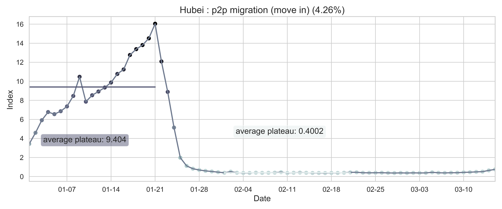



# [Fu Lab](https://fudab.github.io) 
## [COVID-19](https://fudab.github.io/covid-19)

## Effectiveness of Massive Travel Restrictions on Mitigating Outbreaks of COVID-19 in China.
### Xingru Chen, Xin Wang, Timmy Ma, Daniel Escudero and Feng Fu
`Last updated: May 1, 2020`
* This report provides preliminary results and is work in progress.
* More detailed results and figures are in the [Bag End](https://fudab.github.io/covid-19/bag_end_china).
* Original code and data are in the [Github Repository](https://github.com/fudab/China-COVID-19-mobility).

### Abstract
> In the very early stage of an unprecedented outbreak of COVID-19 started in the epicenter, Wuhan, Hubei Province, China, the Chinese government imposed by far the largest scale of strict travel restrictions on more than 11 million people (beyond) on January 23, 2020, amid the busiest period of the year for domestic travels (chunyun, travels made during the Lunar New Year). Such massive travel restrictions have caused dramatic reduction in travel volume, not only for the outflow from Wuhan (Hubei), but also nationwide. Control measures like this helps reduce the number of imported cases to other provinces, which can possibly slowdown the onset of epidemic outbreaks in other regions and potentially weaken the impact of the disease. Here, we are interested in estimating the effectiveness of such massive travel restrictions in the mitigation of disease impact using a data driven approach.

### Data
> The data we use in our research consist of three parts: the COVID-19 infection information, the census, as well as the migration information in China. We consider the data in a provincial level where 26 provinces as well as four municipalities are treated as individual compartments. The start date is January 15, 2020.

#### Data Source
* COVID-19 information: 
[DXY DX Doctor Global Pandemic Real Time Report](https://ncov.dxy.cn/ncovh5/view/en_pneumonia?from=dxy&source=&link=&share=)
[National Health Commission of PRC Daily Report](http://www.nhc.gov.cn/xcs/xxgzbd/gzbd_index.shtml)
* census:[China Census Bureau](http://www.chamiji.com)
* migration information: [Baidu Qianxi](https://qianxi.baidu.com)

#### Data Processing

 <table class="tg">
  <tr>
    <th align="center"></th>
    <th align="center" rowspan="3"></th>
  </tr>
  <tr>
    <td class="tg-cly1">(a) The national level of reported cases since the first 41 reported cases in Hubei Province in Jan 15, 2020.</td>
  </tr>
  <tr>
    <td align="center"></td>
  </tr>
  <tr>
    <td class="tg-cly1">(b) The spacial spread of COVID-19. The five provinces with the highest number of infections are marked on the map. </td>
    <td class="tg-cly1">(c) The provincial level growth of confirmed cases. The curve in a panel represents the number of cumulative infected people in the province and the histogram indicates the number of new infected people everyday.</td>
  </tr>
  <tr>
    <td colspan="2">Figure 1: Summary of the COVID-19 information as of May 10, 2020. The color code in (c) corresponds to the severity of the epidemic.</td>
  </tr>
 </table>

<table align="center">
  <tr>
    <th></th>
    <th></th>
  </tr>
  <tr>
    <td>(a) The sum of province to province migration index in China.</td>
    <td>(d) The nationwide normalized internal-flow ratio in China.</td>
  </tr>
  <tr>
    <td align="center"></td>
    <td align="center"></td>
  </tr>
  <tr>
    <td>(b) The sum of province to province migration index in Hubei Province. Here, Hubei is the destination. </td>
    <td>(e) The province level normalized internal-flow ratio in Hubei Province.</td>
  </tr>
  <tr>
    <td align="center"></td>
    <td align="center"></td>
  </tr>
  <tr>
    <td>(c) The sum of province to province migration index in Hubei Province. Here, Hubei is the place of departure. </td>
    <td>(f) The city level inter-flow ratio in Wuhan City.</td>
  </tr>
  <tr>
    <td colspan="2"></td>
  </tr>
  <tr>
    <td colspan="2">(g) The province level normalized internal-flow ratios in China. </td>
  </tr>
  <tr>
    <td colspan="2">Figure 2: Summary of the migration infromation in China, Hubei province and Wuhan city. The time period for calculating the first average plateau value is from January 1, 2020 to January 21, 2020 and that for calculating the second value is from February 1, 2020 to February 21, 2020. The percentage in the title of every panel indicates the after-to-before ratio.</td>
  </tr>
</table>

