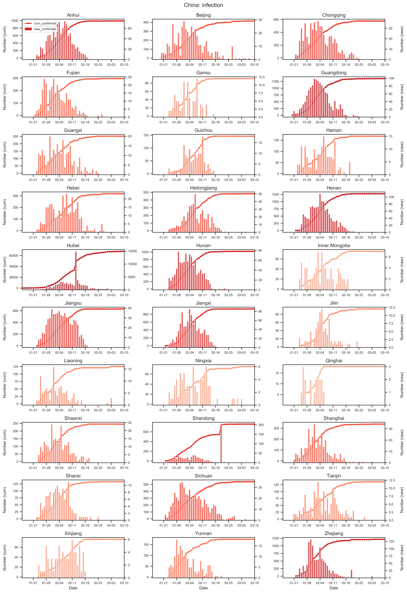
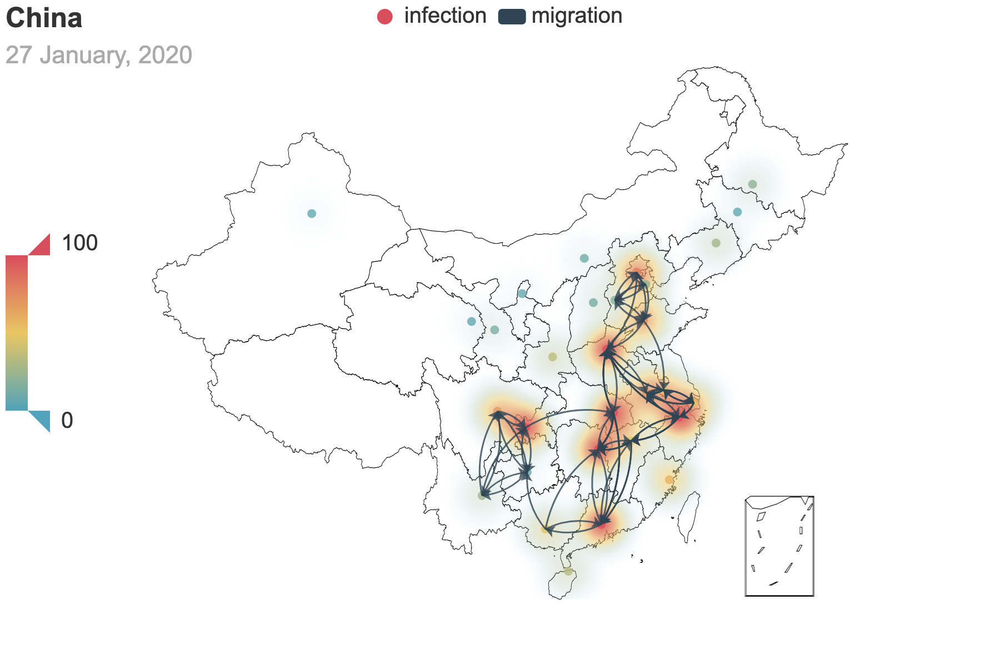
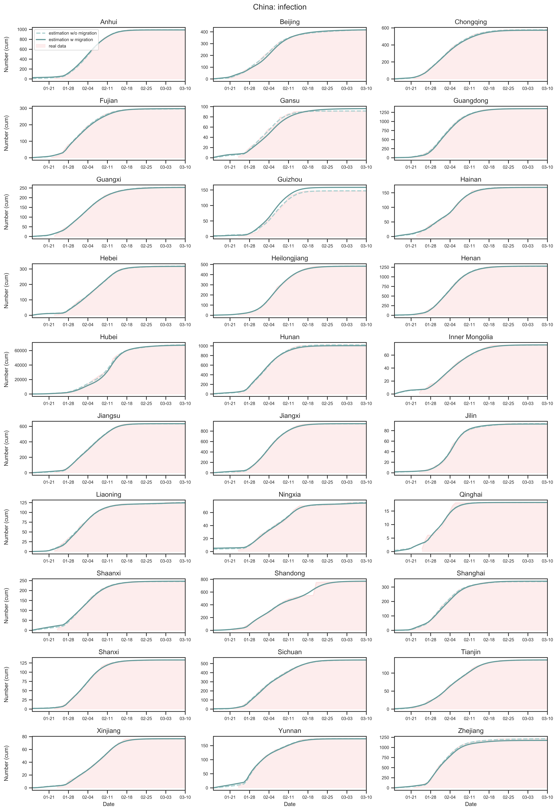
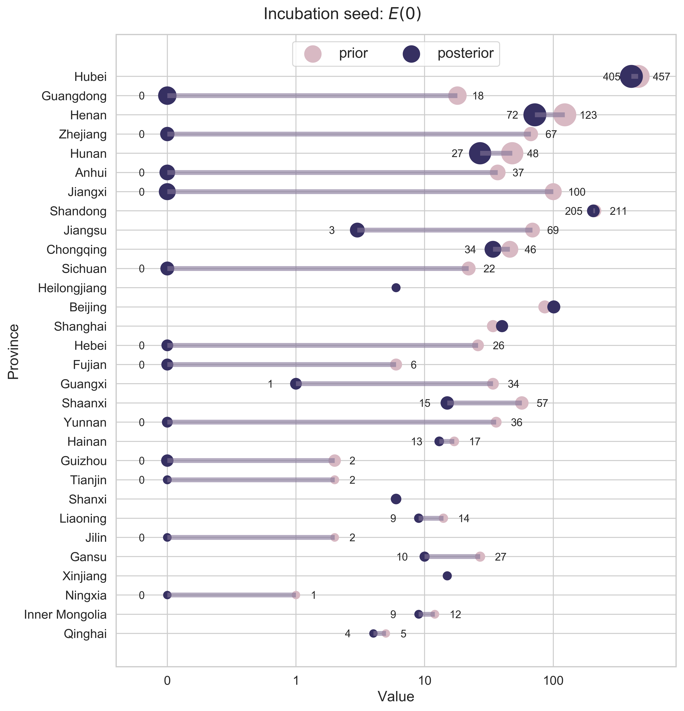
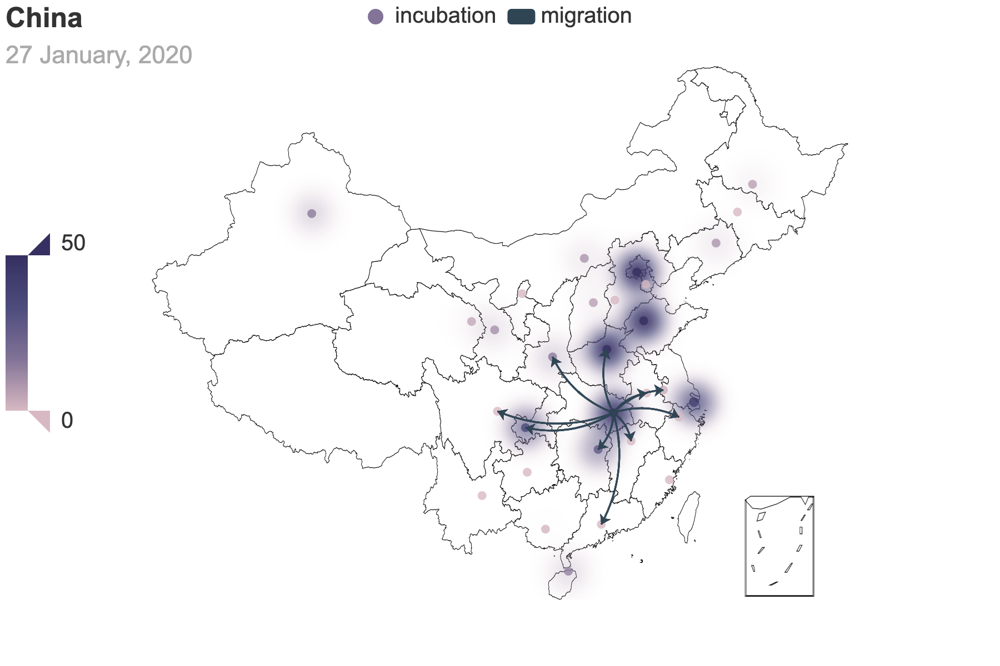
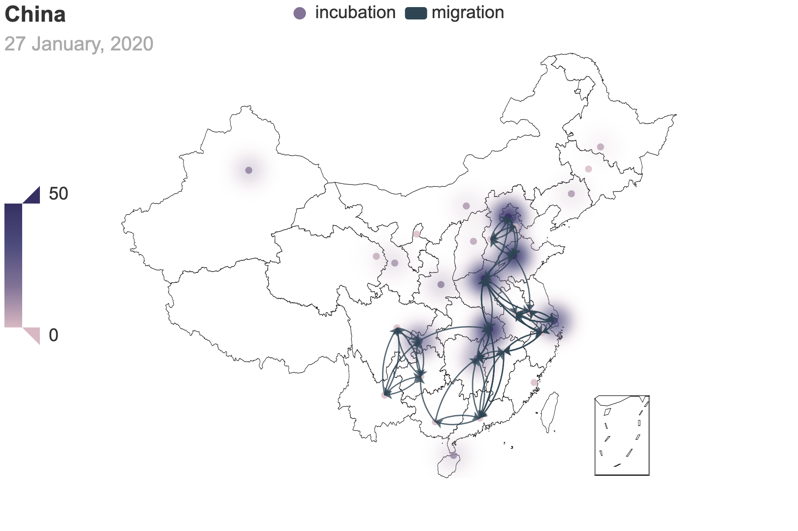
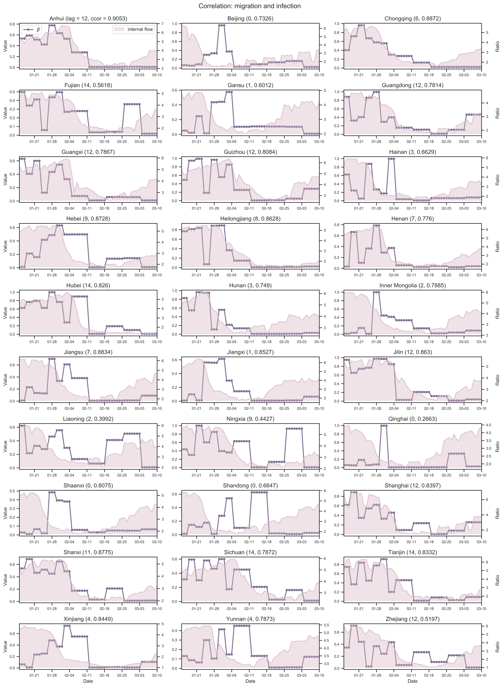
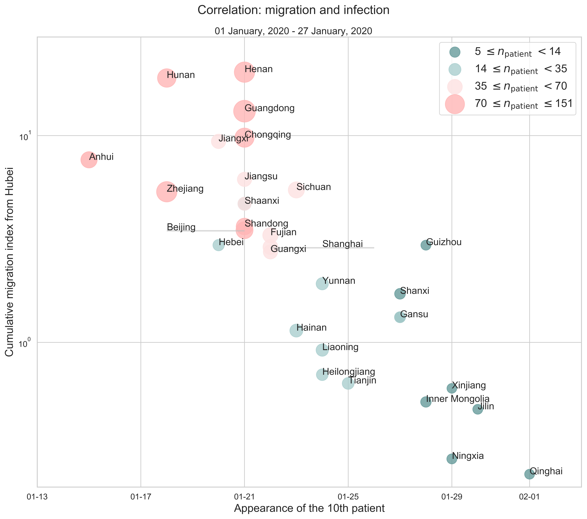



# [Fu Lab](https://fudab.github.io) 
## [COVID-19](https://fudab.github.io/covid-19)

## Effectiveness of Massive Travel Restrictions on Mitigating Outbreaks of COVID-19 in China.
### Xingru Chen, Xin Wang, Timmy Ma, Daniel Escudero and Feng Fu
`Last updated: May 20, 2020`
* This report provides preliminary results and is work in progress.
* More detailed results and figures are in the [Bag End](https://fudab.github.io/covid-19/bag_end_china).
* Original code and data are in the [Github Repository](https://github.com/fudab/China-COVID-19-mobility).

### Abstract
> In the very early stage of an unprecedented outbreak of COVID-19 started in the epicenter, Wuhan, Hubei Province, China, the Chinese government imposed by far the largest scale of strict travel restrictions on more than 11 million people (beyond) on January 23, 2020, amid the busiest period of the year for domestic travels (chunyun, travels made during the Lunar New Year). Such massive travel restrictions have caused dramatic reduction in travel volume, not only for the outflow from Wuhan (Hubei), but also nationwide. Control measures like this helps reduce the number of imported cases to other provinces, which can possibly slowdown the onset of epidemic outbreaks in other regions and potentially weaken the impact of the disease. Here, we are interested in estimating the effectiveness of such massive travel restrictions in the mitigation of disease impact using a data driven approach.

### Data
> The data we used in the research consist of three parts: the COVID-19 infection information, the migration information, as well as the census in mainland China. We dealt with the data in a provincial level where 26 provinces as well as four municipalities are treated as individual compartments. Moreover, for the COVID-19 information, we removed all imported (non-domestic) cases from other countries. The start date is `January 15, 2020` and the end date is `March 10, 2020`.

#### Data Source
* COVID-19 information: 
[DXY Pneumonia](https://ncov.dxy.cn/ncovh5/view/pneumonia)
[National Health Commission of PRC Daily Report](http://www.nhc.gov.cn/xcs/xxgzbd/gzbd_index.shtml)
* migration information: [Baidu Qianxi](https://qianxi.baidu.com)
* census:[China Census Bureau](http://www.chamiji.com)

#### Data Processing

 <table class="tg">
  <tr>
    <th align="center"></th>
    <th align="center" rowspan="3"></th>
  </tr>
  <tr>
    <td class="tg-cly1">(a) The national level of reported cases since the first 41 reported cases in Hubei Province on Jan 15, 2020.</td>
  </tr>
  <tr>
    <td align="center"></td>
  </tr>
  <tr>
    <td class="tg-cly1">(b) The provincial confirmed cases of COVID-19 by March 10, 2020. We only show the 10 provinces or municipalities most affected by the epidemic.</td>
    <td class="tg-cly1">(c) The provincial level growth of confirmed cases. The curve in every panel represents the number of cumulative infected people and the histogram indicates the number of daily new infected people. </td>
  </tr>
  <tr>
    <td colspan="2" align = "center"><iframe src="https://fudab.github.io/covid-19/figures_china/China_heatmap.html" width="750px" height="500px" scrolling="no" frameBorder="0"></iframe></td>
  </tr>
  <tr>
    <td colspan="2">(d) The spacial spread of COVID-19. The five provinces with the highest number of infections are marked on the map.</td>
  </tr>
  <tr>
    <td colspan="2">Figure 1: Summary of the COVID-19 information as of May 10, 2020. To reduce errors, we have removed all imported cases from other countries. The color code in (c) corresponds to the severity of the epidemic.</td>
  </tr>
 </table>

<table align="center">
  <tr>
    <th></th>
    <th></th>
  </tr>
  <tr>
    <td>(a) Nationwide sum of province migration index.</td>
    <td>(d) Nationwide normalized internal-flow ratio. </td>
  </tr>
  <tr>
    <td align="center"></td>
    <td align="center"></td>
  </tr>
  <tr>
    <td>(b) Province migration index of Hubei (as destination). </td>
    <td>(e) Normalized internal-flow ratio of Hubei. </td>
  </tr>
  <tr>
    <td align="center"></td>
    <td align="center"></td>
  </tr>
  <tr>
    <td>(c) Province migration index of Hubei (as place of departure). </td>
    <td>(f) Internal-flow ratio of Wuhan. </td>
  </tr>
  <tr>
    <td colspan="2"></td>
  </tr>
  <tr>
    <td colspan="2">(g) Provincial level normalized internal-flow ratios. The curve of Hubei Province is highlighted with markers.</td>
  </tr>
  <tr>
    <td colspan="2">Figure 2: Summary of the migration infromation in China, Hubei province and Wuhan city. The time period for calculating the first average plateau value is from January 1, 2020 to January 21, 2020 and that for calculating the second value is from February 1, 2020 to February 21, 2020. For panels (a) - (f), the percentage in the title indicates the after-to-before ratio.</td>
  </tr>
</table>

<table align="center">
  <tr>
    <th></th>
    <th></th>
  </tr>
  <tr>
    <td>(a) Migration traces involving the top 10 provinces with the greatest cumulative migration index from the epicenter Hubei Province.</td>
    <td>(b) Recursive migration traces involving the top 3 provinces with the greatest cumulative migration index from the departure provinces.</td>
  </tr>
  <tr>
    <td colspan="2">Figure 3: Migration traces derived from the migration data. Daily migration index from January 1 to January 27 is added to obtain the cumulative index. And we use heatmap to indicate the number of infected people by January 27. For (b), the first place of departure is Hubei, which points to the 3 destinations: Guangdong, Henan and Hunan. These 3 destinations are treated as the new places of departure and new destinations are added. We repeat this process until there is no new destination appears.</td>
  </tr>
</table>

### Method

#### SEIR Model
We consider an SEIR model in a meta population structure with migration. The systems of ODEs describe the dynamics in continuous time $t$, that is, days since the outbreak of the disease:

 \begin{equation}
  \begin{cases}
  \displaystyle \frac{dS_i(t)}{dt} & =  -\beta_i(t) S_i(t) \frac{I_i(t)}{N_i(t)} - \displaystyle\sum_{j, j\neq i}\alpha_{ij}(t)S_i(t) + \sum_{j, j\neq i} \alpha_{ji}(t)S_j(t), \\
  \displaystyle \frac{dE_i(t)}{dt} & =  \beta_i(t) S_i(t)  \frac{I_i(t)}{N_i(t)} - \sigma_i(t) E_i(t) - \displaystyle\sum_{j, j\neq i}\alpha_{ij}(t)E_i(t) + \sum_{j, j\neq i} \alpha_{ji}(t)E_j(t), \\
  \displaystyle \frac{dI_i(t)}{dt} & =  \sigma_i(t) E_i(t) - \gamma_i(t) I_i(t), \\
  \displaystyle \frac{dR_i(t)}{dt} & =  \gamma_i(t) I_i(t). \\
\end{cases}
 \end{equation}

Here, the subscript $1 \leq i \leq m$ refers to the $i$th compartment on the provincial level (in other words, the $i$th province). $N_i(t) = S_i(t) + E_i(t) + I_i(t) + R_i(t)$ is the total population size of compartment $i$ at time $t$. The total outflow from compartment $i$ to other compartments and the total inflow to compartment $i$ from other compartments are

 \begin{equation}
 \displaystyle\sum_{j, j\neq i}\alpha_{ij}(t) \left[S_i(t) + E_i(t) \right],
 \end{equation}

and 

 \begin{equation}
 \displaystyle\sum_{j, j\neq i} \alpha_{ji}(t) \left[S_j(t) + E_j(t) \right],
 \end{equation}

respectively.

To parameterize migration flows between compartments, we utilize the provincial level mobility data from [Baidu Qianxi](https://qianxi.baidu.com). Notice that the number of confirmed cases by March 10 and the population size of a province differ by at least three orders of magnitude (see the infection rates in the [Bag End](https://fudab.github.io/covid-19/bag_end_china)). Hence $S_i(t) + E_i(t)$ is roughly $N_i(t)$ and we can assume that the following two identities always hold:

\begin{equation}
\begin{cases}
\displaystyle\sum_{j, j\neq i}\alpha_{ij}(t) \left[S_i(t) + E_i(t) \right] &\approx \displaystyle\sum_{j, j\neq i}\alpha_{ij}(t)N_i(t) = \theta \displaystyle\sum_{j, j\neq i}m_{ij}, \\
\displaystyle\sum_{j, j\neq i} \alpha_{ji}(t) \left[S_j(t) + E_j(t) \right] & \approx \displaystyle\sum_{j, j\neq i} \alpha_{ji}(t)N_j(t) = \theta \displaystyle\sum_{j, j\neq i}m_{ji}.
\end{cases}
 \end{equation}

Here, $\theta = 100000$ is the unit of p2p migration index.

We further estimate $\alpha_{ij}(t)$ by $\frac{\theta m_{ij}(t)}{N_i(t)}$.  A simplified version of the original system of equations is thus obtained:

\begin{equation}
\begin{cases}
\displaystyle \frac{dS_i(t)}{dt} & =  -\beta_i(t) S_i(t) \frac{I_i(t)}{N_i(t)} - \theta\displaystyle\sum_{j, j\neq i}\frac{ m_{ij}(t)}{N_i(t)}S_i(t) + \theta\sum_{j, j\neq i} \frac{m_{ji}(t)}{N_j(t)}S_j(t), \\
\displaystyle \frac{dE_i(t)}{dt} & =  \beta_i(t) S_i(t)  \frac{I_i(t)}{N_i(t)} - \sigma_i(t) E_i(t) - \theta \displaystyle\sum_{j, j\neq i}\frac{m_{ij}(t)}{N_i(t)}E_i(t) + \theta\sum_{j, j\neq i}\frac{ m_{ji}(t)}{N_j(t)}E_j(t),  \\
\displaystyle \frac{dI_i(t)}{dt} & =  \sigma_i(t) E_i(t) - \gamma_i(t) I_i(t), \\
\displaystyle \frac{dR_i(t)}{dt} & =  \gamma_i(t) I_i(t).
\end{cases}
\end{equation}

In general, all three parameters can be time dependent, due to containment efforts (social distancing). Since time $t$ is discrete in practice, we treat these parameters as piecewise functions, of which every piece is a constant. To simplify the problem, we unify the timeline for all provinces. As mentioned above, the record of the COVID-19 information starts from `January 15` and is truncated to `March 10`. Accordingly, the domain of $t$ in the ODE system can be considered to be $t \in [0, 55]$. In our study, we focus more on the infection rate. After weighing degrees of freedom and flexibility, we assume the following expression where $\beta_i(t)$ is split into twelve pieces, $\sigma_i(t)$ three pieces and the same for $\gamma$:

\begin{equation}
\beta_i(t) = 
  \begin{cases}
  \displaystyle \beta_{ij}, & 3(j - 1) \leq t \leq 3j - 1, \,\,\, \text{for} \,\,\, 1 \leq j \leq  7 \\ 
  \beta_{i(7 + j)}, & 21 + 7(j - 1) \leq t \leq 21 + 7j - 1, \,\,\, \text{for} \,\,\, 1 \leq j \leq 5 
\end{cases}
\end{equation}

\begin{equation}
\sigma_i(t) = 
  \begin{cases}
  \displaystyle \sigma_{i1}, & 0 \leq t \leq 5 \\
  \displaystyle \sigma_{i2}, & 6 \leq t \leq 11 \\
  \displaystyle \sigma_{i3}. & 12 \leq t \leq 55 
\end{cases}
\end{equation}

### Parameter Estimation

#### Prior
Before we include the migration from one compartment to another, we first consider the original SEIR model for every province:

 \begin{equation}
  \begin{cases}
  \displaystyle \frac{dS_i(t)}{dt} =  -\beta_i(t) S_i(t) \frac{I_i(t)}{N_i}, \\
  \displaystyle \frac{dE_i(t)}{dt} =  \beta_i(t) S_i(t)  \frac{I_i(t)}{N_i} - \sigma_i(t) E_i(t), \\
  \displaystyle \frac{dI_i(t)}{dt} =  \sigma_i(t) E_i(t) - \gamma_i(t) I_i(t), \\
  \displaystyle \frac{dR_i(t)}{dt} =  \gamma_i(t) I_i(t). \\
\end{cases}
 \end{equation}

To obtain a prior estimation of the epidemic parameters for the $i$th province, we apply the `dual annealing` algorithm to perform a nonlinear `least square` fitting of the variable $R_i(t)$ and find the global minimum value of the residual. Table 1 shows an ordered dictionary of all the parameter objects required.

<table align="center">
  <tr>
    <th>name</th>
    <th>initial value</th>
    <th>lower bound</th>
    <th>upper bound</th>
    <th>expression</th>
  </tr>
  <tr>
    <td align="center">$N_i$</td>
    <td align="center">$n_i$</td>
    <td align="center"></td>
    <td align="center"></td>
    <td align="center"></td>
  </tr>
  <tr>
    <td align="center">$S_i(0)$</td>
    <td align="center"></td>
    <td align="center"></td>
    <td align="center"></td>
    <td align="center">$N_i - E_i(0) - I_i(0) - R_i(0)$</td>
  </tr>
  <tr>
    <td align="center">$E_i(0)$</td>
    <td align="center">50</td>
    <td align="center">0</td>
    <td align="center">500</td>
    <td align="center"></td>
  </tr>
  <tr>
    <td align="center">$I_i(0)$</td>
    <td align="center">50</td>
    <td align="center">0</td>
    <td align="center">200</td>
    <td align="center"></td>
  </tr>
  <tr>
    <td align="center">$R_i(0)$</td>
    <td align="center">0</td>
    <td align="center">0</td>
    <td align="center">100</td>
    <td align="center"></td>
  </tr>
  <tr>
    <td align="center">$\beta_{ij}$</td>
    <td align="center">0.5</td>
    <td align="center">0.01</td>
    <td align="center">1</td>
    <td align="center"></td>
  </tr>
  <tr>
    <td align="center">$\sigma_{ij}$</td>
    <td align="center">0.5</td>
    <td align="center">0.05</td>
    <td align="center">0.5</td>
    <td align="center"></td>
  </tr>
  <tr>
    <td align="center">$\gamma_{ij}$</td>
    <td align="center">0.5</td>
    <td align="center">0.05</td>
    <td align="center">0.5</td>
    <td align="center"></td>
  </tr>
 <tr>
    <td colspan="5">Table 1: Implementation of parameters with reference to the estimations for epidemic parameters. Here, $n_i$ is the population size of province $i$.</td>
  </tr>
</table>

#### Posterior

After obtaining the prior estimation of parameters for every province, we can further calculate the covariance matrix $\text{cov}(\hat{x})$ and hence the standard errors. The covariance matrix contains complete information about the uncertainty of parameter estimators. To get $\text{cov}(\hat{x})$, we use a linear approximation method through the Jacobian matrix $F$:

\begin{equation}
 \text{cov}(\hat{x}) = s^2(F'F)^{-1}, \qquad \text{with}\, F = \left. \frac{\partial f(x)}{\partial x}\right|_{x = \hat{x}}.
\end{equation}

Here $s^2$ is the unbiased estimation of the variance $\sigma^2$ obtained from the least square residual:

\begin{equation}
 s^2 = \frac{S_\text{min}(r, \hat{x})}{(n - p)N},
\end{equation}

with $n$ being the total number of measurements, $p$ the number of estimated parameters, $n - p$ the degrees of freedom, $N$ the population size and $S_\text{min}(r, \hat{x}) = \displaystyle\sum(r - R(\hat{x}))^2$ the minimum value of the objective function (that is, the least square residual).

It can be seen from the above calculations that $\text{cov}(\hat{x})$ is a $p\times p$ square matrix. In particular, the diagonal elements are simply the variances of the corresponding ordered parameters (namely, the square root of the $k$th diagonal element is the standard error of the $k$th parameter). Following a student $t$-distribution, we can get the confidence intervals at $(1 - 2\alpha)$ significance for all the parameters and thus their lower and upper bounds:

\begin{equation}
\hat{x}_{1 - 2\alpha} = \hat{x} \pm t_{n - p}^{\alpha}\sqrt{\text{diag}\,\text{cov}(\hat{x})}.
\end{equation}

In our model, we have $n = 56$, $p = 21$ and $n - p = 35$ (notice that $N_i$ and $S_i(0)$ are not free parameters). By letting $\alpha = 0.005$, we obtain the $99.99$% confidence interval of every parameter and for every province. Still, we would like to guarantee that the lower and upper bounds of the epidemic parameters are consistent with the sampling of estimations and also the lower bounds of $E_i(0)$, $I_i(0)$ as well as $R_i(0)$ should be non-negative. Combining the above restrictions, we get the updated bounds for the parameters. 

<table align="center">
  <tr>
    <th>name</th>
    <th>initial value</th>
    <th>lower bound</th>
    <th>upper bound</th>
    <th>expression</th>
  </tr>
  <tr>
    <td align="center">$N_i(0)$</td>
    <td align="center">$n_i$</td>
    <td align="center"></td>
    <td align="center"></td>
    <td align="center"></td>
  </tr>
  <tr>
    <td align="center">$S_i(0)$</td>
    <td align="center"></td>
    <td align="center"></td>
    <td align="center"></td>
    <td align="center">$N_i - E_i(0) - I_i(0) - R_i(0)$</td>
  </tr>
  <tr>
    <td align="center">$E_i(0)$</td>
    <td align="center">$E_i^{\text{prior}}(0)$</td>
    <td align="center">0</td>
    <td align="center">$\max(500, E_i^{\text{upper}}(0))$</td>
    <td align="center"></td>
  </tr>
  <tr>
    <td align="center">$I_i(0)$</td>
    <td align="center">$I_i^{\text{prior}}(0)$</td>
    <td align="center">0</td>
    <td align="center">$\max(200, I_i^{\text{upper}}(0))$</td>
    <td align="center"></td>
  </tr>
  <tr>
    <td align="center">$R_i(0)$</td>
    <td align="center">$R_i^{\text{prior}}(0)$</td>
    <td align="center">0</td>
    <td align="center">$\max(100, R_i^{\text{upper}}(0))$</td>
    <td align="center"></td>
  </tr>
  <tr>
    <td align="center">$\beta_{ij}$</td>
    <td align="center">$\beta_{ij}^{\text{prior}}$</td>
    <td align="center">0.01</td>
    <td align="center">$\min(1, \beta_{ij}^{\text{upper}})$</td>
    <td align="center"></td>
  </tr>
  <tr>
    <td align="center">$\sigma_{ij}$</td>
    <td align="center">$\sigma_{ij}^{\text{prior}}$</td>
    <td align="center">0.05</td>
    <td align="center">$\min(0.5, \sigma_{ij}^{\text{upper}})$</td>
    <td align="center"></td>
  </tr>
  <tr>
    <td align="center">$\gamma_{ij}$</td>
    <td align="center">$\gamma_{ij}^{\text{prior}}$</td>
    <td align="center">0.05</td>
    <td align="center">$\min(0.5, \gamma_{ij}^{\text{upper}})$</td>
    <td align="center"></td>
  </tr>
 <tr>
    <td colspan="5">Table 2: Implementation of parameters according to the estimations for epidemic parameters and the results of prior estimation. Still, $n_i$ is the population size of province $i$. The superscripts 'prior' and 'upper' indicate the estimated value and the upper bound from prior estimation.</td>
  </tr>
</table>

Given that even local optimization methods will be rather time consuming under the current situation where we need to solve a giant system of equations, not to mention any global optimization methods, we repeatedly apply the `Levenberg-Marquardt` algorithm, performing the same nonlinear `least square` fitting of the variable $R_i(t)$ and finding the local minimum value of the residual. Every time we select a different province and only allow its parameters to be changeable until we iterate through all provinces. To improve the accuracy of results, we run this process multiple times.

<table align="center">
  <tr>
    <th></th>
  </tr>
  <tr>
    <td>Figure 4: Comparison between real and estimated values of $R_i(t)$. The shaded region, the dashed curve and the solid curve correspond to real data, result of prior estimation without migration and that of posterior estimation with migration, respectively. For prior estimation, the maximal number of global search in the dual annealing algorithm is $20000$ and the initial temperature is $10000$. We use the default settings for the other arguments. As to posterior estimation, the iteration defined above is repeated $50$ times. </td>
  </tr>
</table>

### Discussion on Parameters

We find that there is no major changes of the parametric values in general, excpet for the incubation seed $E(0)$ at every province. In other words, the migraiton from province to province plays a key role in the outbreak in other provinces apart from Hubei. Moreover, correlation analysis between internal flow ratio and infection rate $\beta$ shows that the spread of the disease is in line with the intensity of residents' intra-city travel behavior.

#### Incubation Seed

<table align="center">
  <tr>
    <th></th>
  </tr>
  <tr>
    <td>Figure 5: How the incubation seed $E(0)$ changes before and after considering province to province migration. A horizontal bar is added for the ith province if $E_i(0)$ shrinks. To better present the result, we round up the original values. </td>
  </tr>
</table>

<table align="center">
  <tr>
    <th></th>
    <th></th>
  </tr>
  <tr>
    <td>(a) Migration traces involving the top 10 provinces with the greatest cumulative migration index from the epicenter, Hubei Province.</td>
    <td>(b) Recursive migration traces involving the top 3 provinces with the greatest cumulative migration index from the departure province.</td>
  </tr>
  <tr>
    <td colspan="2">Figure 6: Migration traces derived from the migration data. Daily migration index from January 1 to January 27 is added to obtain the cumulative index. And we use heatmap to indicate the posterior incubation seed $E(0)$. For (b), how we get the places of departure and the destinations is the same as Figure 3.</td>
  </tr>
</table>

#### Transmission Rate

<table align="center">
  <tr>
    <th></th>
  </tr>
  <tr>
    <td>Figure 7: How the infection rate $\beta$ changes before and after considering province to province migration. It is not hard to see that there is no significant change in the values. The sudden changes where prior estimation of $\beta$ is close to zero may due to the instability of the Levenberg-Marquardt algorithm. </td>
  </tr>
</table>

<table align="center">
  <tr>
    <th></th>
  </tr>
  <tr>
    <td>Figure 8: The correlation between internal flow ratio and infection rate $\beta$. Regarding the provincial internal flow ratio and $\beta$ as two time series, we calculate their cross correlations with different lags (unit: day) and figure out the maximum value of the correlation coefficent as well as the corresponding lag, both of which are given in the title of every panel. In accordance with the cuase-effect relation where people's travel behavior leads the spread of the disease, we assume that the lag is positive. </td>
  </tr>
</table>

#### Infection Number

<table align="center">
  <tr>
    <th></th>
  </tr>
  <tr>
    <td> Figure 9: The correlation between province to province migration and infection number. We consider migration from the epicenter Hubei to the other provinces. Each point represents a province. The x-axis is the cumulative migration index from January 1 to January 27 and the y-axis is the date on which the 10th patient appeared according to the estimated values of $R(t)$ in the SEIR model. The size of the ith point is linearly related to the number of cumulative confirmed cases at the corresponding province by January 27. </td>
  </tr>
</table>

