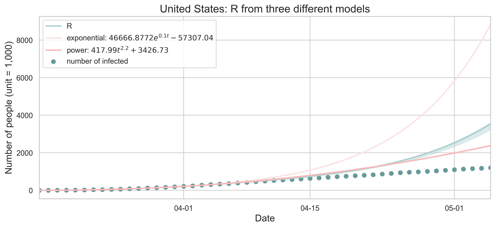

# [Fu Lab](https://fudab.github.io) 
## [COVID-19](https://fudab.github.io/covid-19.md)

## When and how will the COVID-19 pandemic end in the United States?
### Xingru Chen and Feng Fu
#### `April 12, 2020`
#### `This report provides preliminary results and is work in progress`

### Abstract
> The COVID-19 pandemic has upended everyone’s normal life, health crisis, lockdowns, and economic percussions in an unprecedented pace and scale. We will get over this pandemic but at what prices? Here we estimate the burden of COVID-19 in the United States, peak time, and total number of infections, in coming months.

### Data
> The data we use in our research consist of four parts: the COVID-19 infection information, the census, and the voting information of the United States as well as the migration information in China. We consider the data in a state level where 50 states as well as District of Columbia are treated as individual compartments. The start date is January 21, 2020.

#### Data Source
* United States
  * COVID-19 information: [New York Times COVID-19 Warehouse](https://github.com/nytimes/covid-19-data)
  * census: [United States Census Bureau](https://simple.wikipedia.org/wiki/List_of_U.S._states_by_population)
  * Rural-Urban Continuum Codes: [United States Department of Agriculture](https://www.ers.usda.gov/data-products/rural-urban-continuum-codes/)
  * migration information: [Descartes Labs](https://github.com/descarteslabs/DL-COVID-19)
  * stock market: [Yahoo Finance](https://finance.yahoo.com/)
  * voting information: [Cook Partisan Voting Index](https://en.wikipedia.org/wiki/Cook_Partisan_Voting_Index)
* Mainland China
  * migration information: [Baidu Qianxi](https://qianxi.baidu.com)
  * census: [China Census Bureau](http://www.chamiji.com)
  
#### Data Processing

 <table class="tg">
  <tr>
    <th align="center"></th>
    <th align="center" rowspan="3"></th>
  </tr>
  <tr>
    <td class="tg-cly1">(a) The state level of reported cases as of April 12, 2020 since the first reported case in United States in Jan 21, 2020.</td>
  </tr>
  <tr>
    <td align="center"></td>
  </tr>
  <tr>
    <td class="tg-cly1">(b) The spacial spread of COVID-19 by April 12, 2020. The number of infected is displayed on a logarithmic scale.</td>
    <td class="tg-cly1">(c) The state level growth of confirmed cases. The curve in a panel repre- sents the number of cumulative infected people in the state and the histogram indicates the number of new infected people everyday.</td>
  </tr>
  <tr>
    <td colspan="2">Figure 1: Summary of the COVID-19 information by April 12, 2020. The color code in (a) and (c) corresponds to the partisan voting index (PVI) by each state.</td>
  </tr>
 </table>

 <table align="center">
  <tr>
    <th align="center"></th>
  </tr>
  <tr>
    <td>(a) The nationwide internal-flow ratio in China.</td>
  </tr>
  <tr>
    <td align="center"></td>
  </tr>
  <tr>
    <td>(b) The province level internal-flow ratio in Hubei Province.</td>
  </tr>
  <tr>
    <td align="center"></td>
  </tr>
  <tr>
    <td>(c) The city level inter-flow ratio in Wuhan City.</td>
  </tr>
 <tr>
    <td>Figure 2: The internal-flow ratios on three different levels in China. The time period for calculating the first average plateau value is from January 1, 2020 to January 21, 2020 and that for calculating the second value is from February 1, 2020 to February 21, 2020. The percentage in the title of every panel indicates the after-to-before ratio.</td>
  </tr>
 </table>

### Method

#### SEIR Model
We consider an SEIR model in a population structure for every state. The systems of ODEs describe the dynnamics in continuous time t, that is, days since the outbreak of the disease:

\begin{equation}
  \begin{cases}
  \displaystyle \frac{dS_i(t)}{dt} =  -\beta_i(t) S_i(t) \frac{I_i(t)}{N_i}, \\
  \displaystyle \frac{dE_i(t)}{dt} =  \beta_i(t) S_i(t)  \frac{I_i(t)}{N_i} - \sigma_i(t) E_i(t), \\
  \displaystyle \frac{dI_i(t)}{dt} =  \sigma_i(t) E_i(t) - \gamma_i(t) I_i(t), \\
  \displaystyle \frac{dR_i(t)}{dt} =  \gamma_i(t) I_i(t). \\
\end{cases}
\end{equation}

Here, the subscript $i$ refers to the $i$th compartment on the state level (in other words, the $i$th state) and $N_i(t) = S_i(t) + E_i(t) + I_i(t) + R_i(t)$ is the population size of compartment $i$. 

In general, all three parameters can be time dependent, due to containment efforts (social distancing). Since time $t$ is discrete in practice, we treat these parameters as piecewise functions, of which every piece is a constant. To simplify the problem, we only pick two important dates as breaking points of the piecewise functions: `March 15` (since when quarantine was executed) and `March 29` (2 weeks after March 15 and since when more severe actions were taken). As a result, the function $\beta_i(t)$ is split into three piece, same for $\sigma_i(t)$ and $\gamma_i(t)$:

\begin{equation}
  \begin{cases}
  \displaystyle \beta_{i1}, & \text{before and on March 15} \\
  \displaystyle \beta_{i2}, & \text{from March 16 to March 29} \\
  \displaystyle \beta_{i3}. &  \text{after and on March 30} \\
\end{cases}
\end{equation}

#### Exponential and Power Growth

Apart from the above compartmental model, we also experiment with two popular curve fitting models: exponential and power growth. For these kind of least square regression methods, we restrict ourselves to the national cases and start the fitting from `March 9` (a week before the first breaking point chosen above) to fix the error in the early states of testing in every state.

More concretely, we assume that the general expressions are:

\begin{equation}
 f(t) = ae^{bt} + c, \qquad f(t) = at^b + c,
\end{equation}
 

### Parameter Estimation

We turncate the date to `April 5`, which is one week after `March 29`.

To obtain a satisfactory estimation of the epidemic parameters for the $i$th state, we apply the `dual annealing` algorithm to perform a nonlinear least square fitting of the variable $R_i(t)$ and find the global minimum value of the residual. The table below shows an ordered dictionary of all the parameter objects required.

<table align="center" margin-left: auto;margin-right: auto>
  <tr>
    <th>name</th>
    <th>initial value</th>
    <th>lower bound</th>
    <th>upper bound</th>
    <th>expression</th>
  </tr>
  <tr>
    <td align="center">$N_i$</td>
    <td align="center">$n_i$</td>
    <td align="center"></td>
    <td align="center"></td>
    <td align="center"></td>
  </tr>
  <tr>
    <td align="center">$S_i(0)$</td>
    <td align="center"></td>
    <td align="center"></td>
    <td align="center"></td>
    <td align="center">$N_i - E_i(0) - I_i(0) - R_i(0)$</td>
  </tr>
  <tr>
    <td align="center">$E_i(0)$</td>
    <td align="center">50</td>
    <td align="center">0</td>
    <td align="center">1000</td>
    <td align="center"></td>
  </tr>
  <tr>
    <td align="center">$I_i(0)$</td>
    <td align="center">50</td>
    <td align="center">0</td>
    <td align="center">500</td>
    <td align="center"></td>
  </tr>
  <tr>
    <td align="center">$R_i(0)$</td>
    <td align="center">0</td>
    <td align="center">0</td>
    <td align="center">100</td>
    <td align="center"></td>
  </tr>
  <tr>
    <td align="center">$\beta_{ij}$</td>
    <td align="center">0.5</td>
    <td align="center">0.01</td>
    <td align="center">3</td>
    <td align="center"></td>
  </tr>
  <tr>
    <td align="center">$\sigma_{ij}$</td>
    <td align="center">0.5</td>
    <td align="center">0.02</td>
    <td align="center">1</td>
    <td align="center"></td>
  </tr>
  <tr>
    <td align="center">$\gamma_{ij}$</td>
    <td align="center">0.5</td>
    <td align="center">0.02</td>
    <td align="center">1</td>
    <td align="center"></td>
  </tr>
 <tr>
    <td colspan="5">Table 1: Implementation of parameters according to the sampling of the estimates for epidemic parameters. Here, $n_i$ is the population size of state $i$.</td>
  </tr>
</table>

Meanwhile, we can compare the SEIR model with the least square regression methods. 
<table align="center">
  <tr>
    <th align="center"></th>
  </tr>
  <tr>
    <td>Figure 3: All three models: SEIR, exponential growth and power growth. Scatters indicate the actual number of infected people and the curves are the corresponding results of least square fitting.</td>
  </tr>
</table>

### Discussion on Contact Rate

We first work on four discrete threshold values of contact rate reduction: `100% (status quo)`, `50%`, `25%` and `0 (complete lockdown)`.

#### Discrete variation

#### Continuous variation

