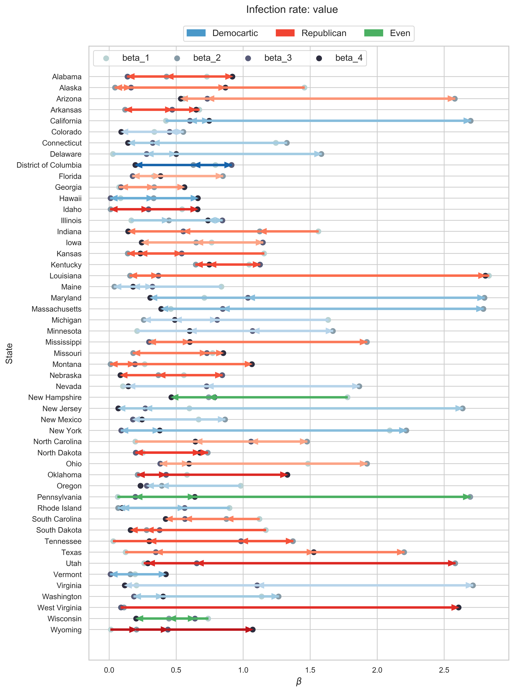
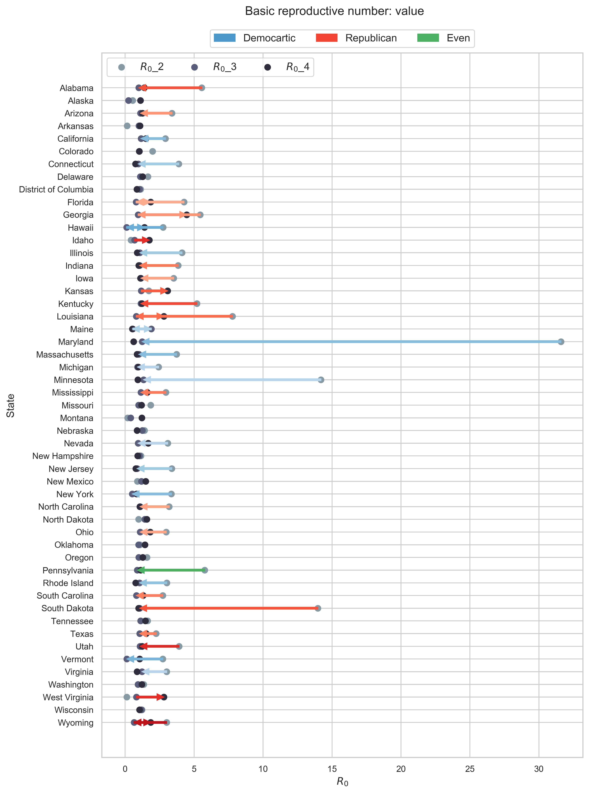
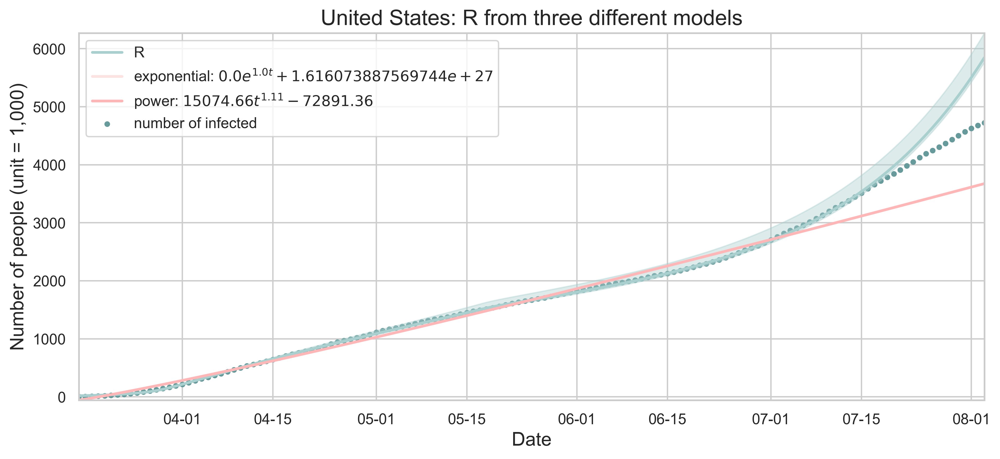
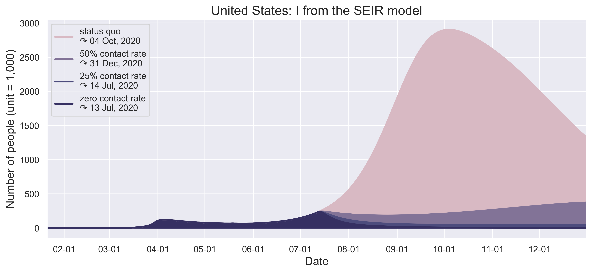
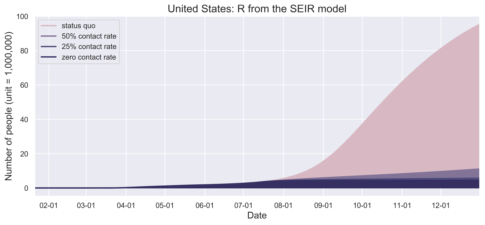
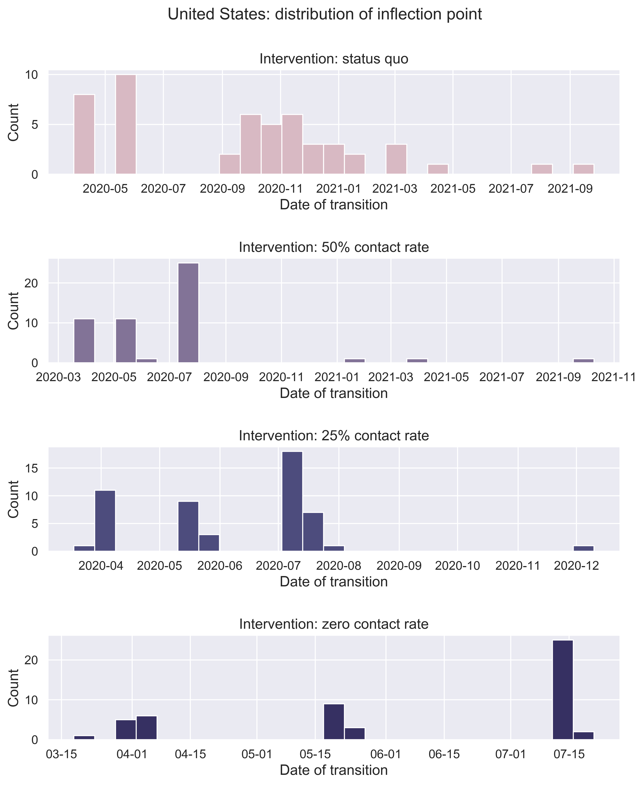
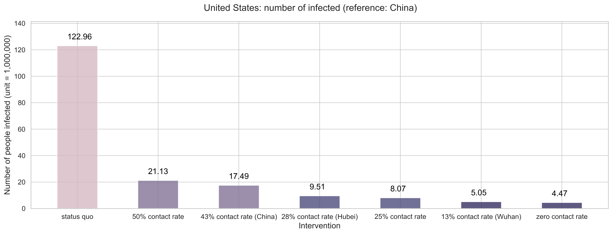
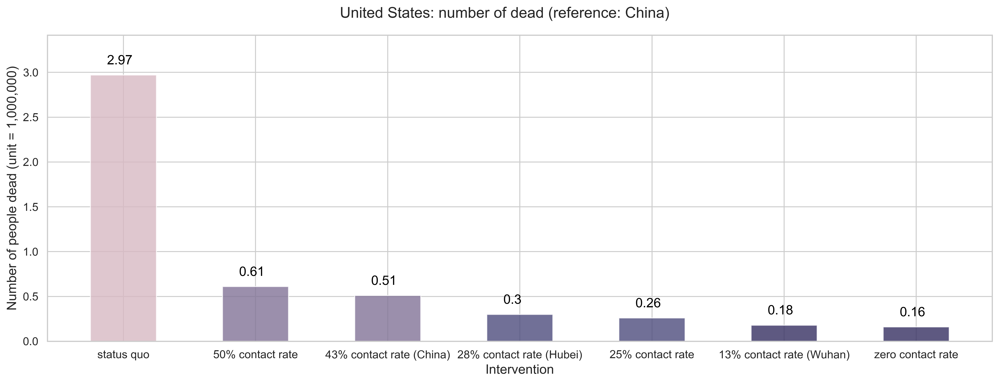



# [Fu Lab](https://fudab.github.io) 
## [COVID-19](https://fudab.github.io/covid-19)

## When and how will the COVID-19 pandemic end in the United States?
### Xingru Chen and Feng Fu
##### `This report provides results from old simulations`      `Last updated: August 5, 2020`

### Parameter Estimation

We turncate the date to `July 12`.

<table align="center">
  <tr>
    <th align="center"></th>
  </tr>
  <tr>
    <td>(a) Number of people infected.</td>
  </tr>
  <tr>
    <td align="center"></td>
  </tr>
  <tr>
    <td>(b) Percentage of people infected.</td>
  </tr>
  <tr>
    <td>Figure 1: Cumulative incidence of COVID-19 cases in every one of the 50 U.S. states (D.C. is also included) as well as projected increase and peak time based on real data. The error bar is also shown in every panel.</td>
  </tr>
</table>

<table align="center">
  <tr>
    <th></th>
    <th></th>
  </tr>
  <tr>
    <td>(a) Contact rate $\beta$.</td>
    <td>(b) Basic reporductive number $R_0$. We only show the second and the third values of it. </td>
  </tr>
  <tr>
    <td colspan="2">Figure 2: How the parameters change over time.</td>
  </tr>
</table>

<table align="center">
  <tr>
    <th align="center"></th>
  </tr>
  <tr>
    <td>Figure 3: All three models: SEIR, exponential growth and power growth. The start date of the fitting is March 16, 2020. Scatters indicate the actual number of infected people and the curves are the corresponding results of least square fitting. The error bar is shown for R. </td>
  </tr>
</table>

### Discussion on Contact Rate

#### Discrete Variation
 
 <table align="center">
  <tr>
    <th><iframe src="https://fudab.github.io/covid-19/figures_us/0712/US_map_status_quo_0712.html" width="450px" height="300px" scrolling="no" frameBorder="0"></iframe></th>
    <th><iframe src="https://fudab.github.io/covid-19/figures_us/0712/US_map_weak_0712.html" width="450px" height="300px" scrolling="no" frameBorder="0"></iframe></th>
  </tr>
  <tr>
    <td>(a) Status quo contact rate as a result of social distancing.</td>
    <td>(b) 50% reduction.</td>
  </tr>
  <tr>
    <td align="center"><iframe src="https://fudab.github.io/covid-19/figures_us/0712/US_map_moderate_0712.html" width="450px" height="300px" scrolling="no" frameBorder="0"></iframe></td>
    <td align="center"><iframe src="https://fudab.github.io/covid-19/figures_us/0712/US_map_strong_0712.html" width="450px" height="300px" scrolling="no" frameBorder="0"></iframe></td>
  </tr>
  <tr>
    <td>(c) 75% reduction.</td>
    <td>(d) zero contract.</td>
  </tr>
 <tr>
    <td align="center"></td>
    <td align="center"></td>
  </tr>
  <tr>
    <td>(e) When will the inflection points come? </td>
    <td>(f) When will the curves be flattened?</td>
  </tr>
  <tr>
    <td colspan="2">Figure 5: (a) to (d) present the spatiotemporal spread of predicted COVID-19 by September 1 with different scenarios of contact reductions due to control measures instituted in each State and by the federal government. (e) and (f) show the growth patterns of the number of infected people. </td>
  </tr>
 </table>
 
<table align="center">
  <tr>
    <th></th>
  </tr>
  <tr>
    <td>Figure 5: When will the inflection point come? Or it may have arrived for certain states. We consider the distribution of the date on which a state will encounter the peak value of number of new infected.</td>
  </tr>
</table>

<table align="center">
  <tr>
    <th align="center"></th>
  </tr>
  <tr>
    <td>(a) Number of pepole (I) from the SEIR model.</td>
  </tr>
  <tr>
    <td align="center"></td>
  </tr>
  <tr>
    <td>(b) Percentage of people (I) from the from the SEIR model.</td>
  </tr>
  <tr>
    <td>Figure 6: Flatten the curve under contact rate reductions for different compliance levels of social distancing. In the figure legend, we show when the outbreak of COVID-19 in each state will peak under different scenarios.</td>
  </tr>
</table>
 
<table align="center">
  <tr>
    <th></th>
  </tr>
  <tr>
    <td>(a) Number of people infected in the end. If we let the outbreaks continue its current trajectory without any effective measures, the total infections can reach 106 million. With 50% reduction rate, 10 million and 300 thousand infection, and with 75% reductions, 5 million and 300 thousand people would get infected. Even for the zero contact rate, around 4 million and 700 thousand cases.</td>
  </tr>
  <tr>
    <td align="center"></td>
  </tr>
  <tr>
    <td>(b) Number of people dead in the end. If we let the outbreaks continue its current trajectory without any effective measures, the total deaths can reach around 2 and a half million. With 50% reduction rate, 270 thousand deaths, and with 75% reductions, 170 thousand people would be dead. Even for the zero contact rate, 160 thousand deaths. </td>
  </tr>
  <tr>
    <td align="center">Figure 7: Mitigation effects by the numbers. </td>
  </tr>
</table>

#### Continuous Variation

<table align="center">
  <tr>
    <th align="center"></th>
  </tr>
  <tr>
    <td>(a) Number of pepole (R) from the SEIR model.</td>
  </tr>
  <tr>
    <td align="center"></td>
  </tr>
  <tr>
    <td>(b) Percentage of people (R) from the from the SEIR model.</td>
  </tr>
  <tr>
    <td>Figure 8: How far do we need to push the quarantine? It may vary from state to state. The x axis indicates the contact rate and the y axis is the final number of infected.</td>
  </tr>
</table>
