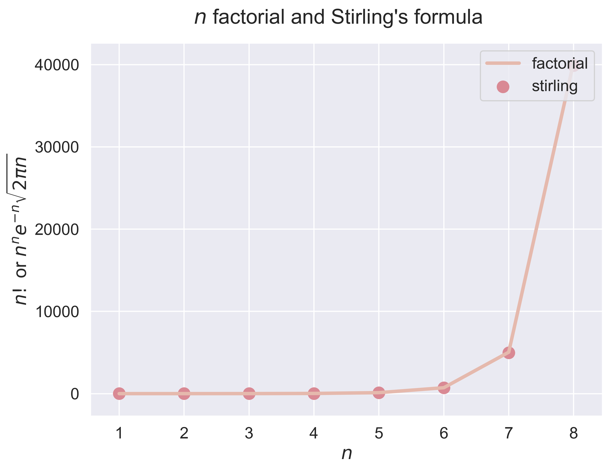
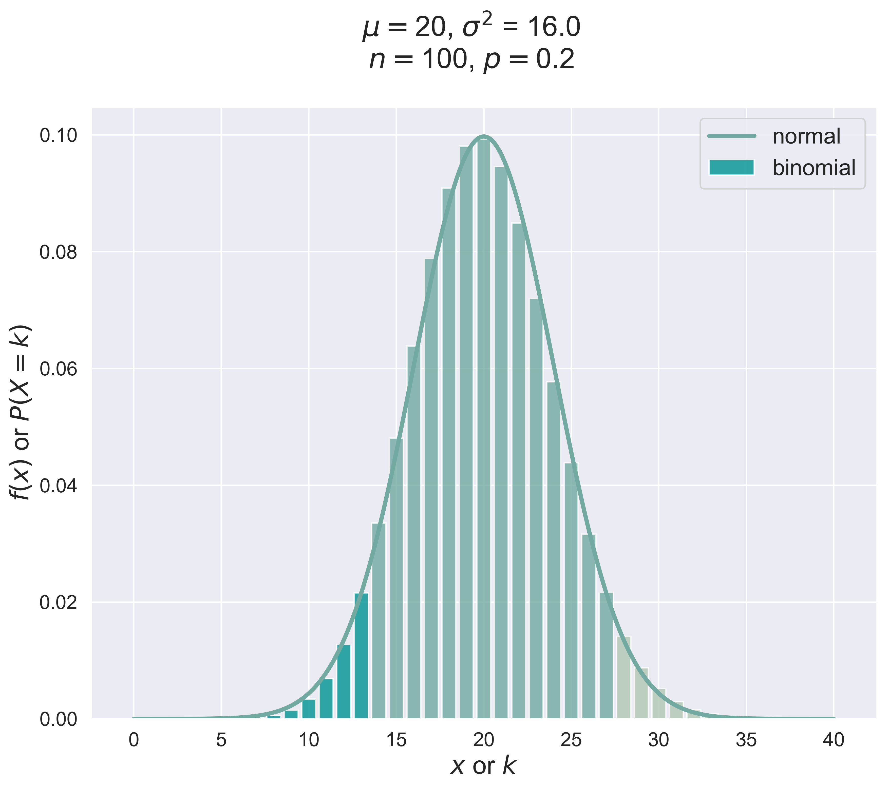
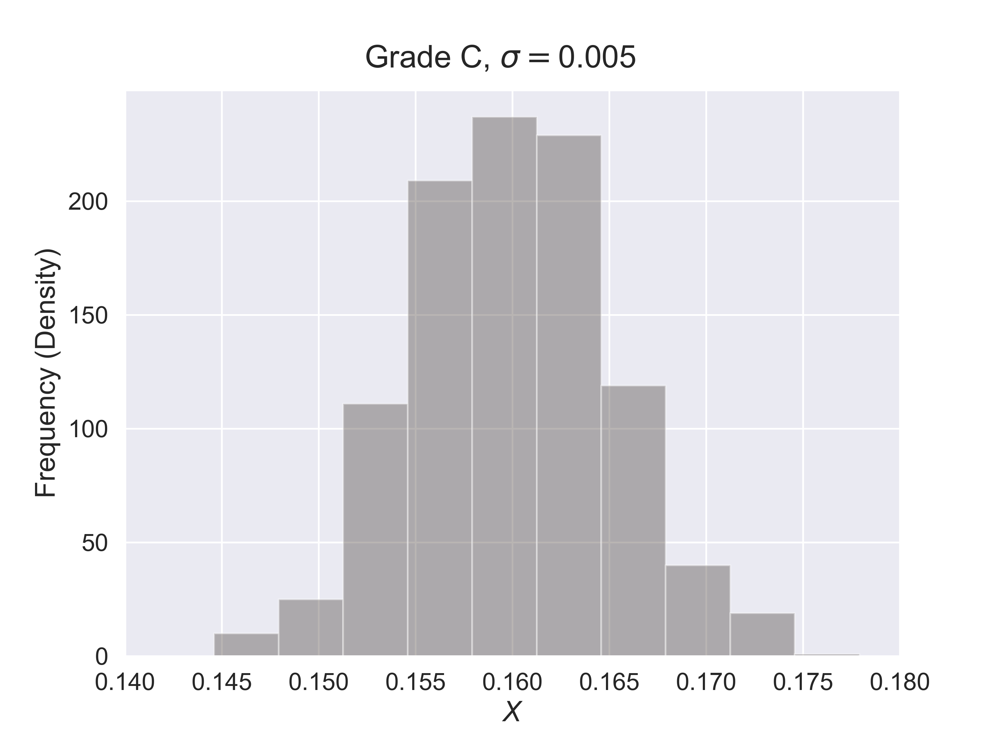

# Math 20: Probability

## About

> ### probability distributions
> ### python graph gallery
> ### reproducible python code

> ### main data analysis and math tools: 
> * Numpy
> * Pandas
> * Math
> * Scipy

> ### main ploting tools: 
> * Matplotlib
> * Seaborn
> * Plotly

Original code and data are in the [Github Repository](https://github.com/fudab/Math-20). Both the web page and the code will be updated irregularly.

`Last updated: July 10`

## Slides 0629

* ### How Much Does a Hershey Kiss Weight?
```python
figure_hershey_dist(n, fsize, fs)
```
<table align = "center">
<thead>
  <tr>
    <th></th>
    <th></th>
  </tr>
</thead>
<tbody>
  <tr>
    <td align = "center"></td>
    <td align = "center"></td>
  </tr>
</tbody>
</table>

## Slides 0701

* ### US States 
```python
us_map_html(dict_state, target, title = None, country = 'US', cmap = tealrose)
us_map_png(dict_state, target, title = None, country = 'US', cmap = tealrose)
```
<table align="center">
  <tr>
    <th><iframe src="https://fudab.github.io/math20/figures/US_map_population.html" width="450px" height="300px" scrolling="no" frameBorder="0"></iframe></th>
    <th><iframe src="https://fudab.github.io/math20/figures/US_map_area.html" width="450px" height="300px" scrolling="no" frameBorder="0"></iframe></th>
  </tr>
 </table>
  
* ### Histograms of Discrete Probability Distributions

>   * #### fundamental distributions
```python
figure_discrete_hist(job = 'coin', fsize = (8, 6), fs = 20)
figure_discrete_hist(job = 'dice', fsize = (8, 6), fs = 20)
figure_discrete_hist(job = 'bino', fsize = (8, 6), fs = 20)
figure_discrete_hist(job = 'poisson', fsize = (8, 6), fs = 20)
```
  
<table align = "center">
<thead>
  <tr>
    <th></th>
    <th></th>
  </tr>
</thead>
<tbody>
  <tr>
    <td align = "center"></td>
    <td align = "center"></td>
  </tr>
</tbody>
</table>

>   * #### refinement of $d\omega$
```python
figure_discrete_hist(job = 'bino_1', fsize = (8, 6), fs = 20)
figure_discrete_hist(job = 'bino_2', fsize = (8, 6), fs = 20)
figure_discrete_hist(job = 'bino_5', fsize = (8, 6), fs = 20)
figure_discrete_hist(job = 'bino_10', fsize = (8, 6), fs = 20)
```
  
<table align = "center">
<thead>
  <tr>
    <th></th>
    <th></th>
  </tr>
</thead>
<tbody>
  <tr>
    <td align = "center"></td>
    <td align = "center"></td>
  </tr>
</tbody>
</table>  

* ### Riemann Sum of a Function
```python
figure_riemann_sum(job = 'power', fsize = (8, 6), fs = 20)
figure_riemann_sum(job = 'sin', fsize = (8, 6), fs = 20)
```
<table align = "center">
<thead>
  <tr>
    <th></th>
    <th></th>
  </tr>
</thead>
</table>  

* ### Exponential Distribution: Density Function and Cumulative Distribution Function
```python
figure_exp_dist(job = 'pdf', fsize = (8, 6), fs = 18)
figure_exp_dist(job = 'cdf', fsize = (8, 6), fs = 18)
```
<table align = "center">
<thead>
  <tr>
    <th></th>
    <th></th>
  </tr>
</thead>
</table>

## Slides 0706

* ### Factorial and Stirling's Formula
```python
stirling(n = 10)
figure_stirling(n = 8, fsize = (8, 6), fs = 18)
```
<table align = "center">
<thead>
  <tr>
    <th></th>
    <th></th>
    <th></th>
  </tr>
</thead>
</table>

* ### Hat Check Problem (Fixed Point)
```python
hat_check(n = 10)
figure_hat_check(n = 15, fsize = (12, 6), fs = 20)
```
<table align = "center">
<thead>
  <tr>
    <th></th>
  </tr>
</thead>
</table>

## Slides 0708

* ### Pascal's Triangle
```python
from scipy.special import comb
pascal(n = 10, j = 5)
```

## Quiz 4

* ### Fixed Points
```python
fixed_points(n = 6, printing = True)
figure_fixed_points(n = 6, fsize = (8, 6), fs = 18)
```
<table align = "center">
<thead>
  <tr>
    <th></th>
    <th></th>
  </tr>
</thead>
</table>

## Slides 0710

* ### One Dimensional Random Walk
```python
random_walk_1D(n = 10, p = 0.6)
path_rw_2D(n = 10, p = 0.6, fsize = (8, 6), fs = 18, index = 1)
```
<table align = "center">
<thead>
  <tr>
    <th></th>
    <th></th>
  </tr>
</thead>
<tbody>
  <tr>
    <td align = "center"></td>
    <td align = "center"></td>
  </tr>
</tbody>
</table> 

* ### Two Dimensional Random Walk: A Homework Problem

* ### Stock Market
```python
import yfinance as yf
load_STOCK_raw(company_index = 'AAPL')
figure_stock_price(company_index = 'AMZN', date_initial = datetime.date(int(2020),int(6),int(1)), 
                   fsize = (12, 6), fs = 20)
```
<table align = "center">
<thead>
  <tr>
    <th></th>
    <th></th>
  </tr>
</thead>
<tbody>
  <tr>
    <td align = "center"></td>
    <td align = "center"></td>
  </tr>
  <tr>
    <td align = "center"></td>
    <td align = "center"></td>
  </tr>
</tbody>
</table> 

* #### Two Dimensional Random Walk (Take-Home Problem)
```python
random_walk_2D(n = 500, p_x = 0.5, p_y = 0.5)
path_rw_2D(n = 500, p_x = 0.5, p_y = 0.5, fsize = (8, 8), fs = 18, index = 1)
```
<table align = "center">
<thead>
  <tr>
    <th></th>
    <th></th>
  </tr>
</thead>
</table>


## Slides 0717

* ### Two Dimensional Normal Distribution: Density Function and Contour curve
```python
figure_normal_2d(ind = True, fsize = (10, 6), fs = 20)
figure_contour_normal_2d(ind = True, fsize = (10, 6), fs = 20)
```
<table align = "center">
<thead>
  <tr>
    <th></th>
    <th></th>
  </tr>
</thead>
</table>

<table align = "center">
<thead>
  <tr>
    <th></th>
    <th></th>
  </tr>
</thead>
</table>


## Midterm 1

* ### Random Walk Model for Stock Price
```python
random_walk_sp(n = 30, p = 0.6, c = 100, u = 1.1, d = 0.9)
path_rw_sp(company_index = 'DIS', date_initial = datetime.date(int(2020),int(6),int(1)), p = 0.6, u = 1.1, d = 0.9, 
           fsize = (12, 6), fs = 20, index = 1)
```
<table align = "center">
<thead>
  <tr>
    <th></th>
    <th></th>
  </tr>
</thead>
</table>


## Slides 0727
* ### Binomial Distribution Versus Poisson Distribution
```python
binomial_poisson_figure(n = 10, p = 0.2, fsize = (8, 6), fs = 18, tag = 1)
```
<table align = "center">
<thead>
  <tr>
    <th></th>
    <th></th>
    <th></th>
  </tr>
</thead>
</table>

* ### Sample With or Without Replacement 
```python
scatters(n = 3, k = 5, fsize = (10, 10), fs = 20)
```
<table align = "center">
<thead>
  <tr>
    <th></th>
    <th></th>
  </tr>
</thead>
</table>

## Slides 0729

* ### Continuous Uniform Distribution
```python
figure_continuous_uniform(fsize = (10, 6), fs = 20)
```
* ### Exponential Distribution 
```python
figure_exponential(fsize = (10, 6), fs = 20)
```
* ### Normal Distribution 
```python
figure_normal(fsize = (10, 6), fs = 20)
```
<table align = "center">
<thead>
  <tr>
    <th></th>
    <th></th>
    <th></th>
  </tr>
</thead>
</table>

* ### 3-$\sigma$ Principle
```python
figure_normal_sd(mu = 0, sigma = 1, c = 1, fsize = (10, 6), fs = 20)
```
<table align = "center">
<thead>
  <tr>
    <th></th>
    <th></th>
    <th></th>
  </tr>
</thead>
</table>

* ### Binomial Distribution Versus Normal Distribution
```python
binomial_normal_figure(n = 10, p = 0.2, fsize = (10, 8), fs = 20, tag = 1)
```
<table align = "center">
<thead>
  <tr>
    <th></th>
    <th></th>
    <th></th>
  </tr>
</thead>
</table>


## Slides 0803
* ### How to Estimate the Quality of Hershey Kisses?
```python
figure_hershey_var_dist(sigma = 0.001, fsize = (8, 6), fs = 18)
```
<table align = "center">
<thead>
  <tr>
    <th></th>
    <th></th>
    <th></th>
  </tr>
</thead>
</table>

## Slides 0807
* ### Cauchy Distribution
```python
figure_cauchy(fsize = (10, 6), fs = 20)
```
<table align = "center">
<thead>
  <tr>
    <th></th>
  </tr>
</thead>
</table>


* ### Pokemon
```python
figure_pokemon(df = data_pokemon, column_A = 'Attack', column_B = 'Defense', job = 'scatter', fs = 16)
figure_pokemon(df = data_pokemon, column_A = 'Attack', column_B = 'Defense', job = 'hex', fs = 16)
figure_pokemon(df = data_pokemon, column_A = 'Attack', column_B = 'Defense', job = 'kde', fs = 16)
```
<table align = "center">
<thead>
  <tr>
    <th></th>
    <th></th>
    <th></th>
    <th></th>
    <th></th>
    <th></th>
  </tr>
</thead>
</table>


* ### Red Wine
```python
fig = figure_wine(df = data_wine, column_A = 'fixed acidity', column_B = 'density', job = 'reg', fs = 16)
```

<table align = "center">
<thead>
  <tr>
    <th></th>
    <th></th>
    <th></th>
    <th></th>
  </tr>
</thead>
</table>

* ### Question 5 in Quiz 10
```python
question_5_quiz_10(fsize = (10, 8), fs = 18)
```
<table align = "center">
<thead>
  <tr>
    <th></th>
  </tr>
</thead>
</table>


## Progress

The dates are consistent with the class.

- [x] 0629
- [x] 0701
- [x] 0706
- [x] 0708
- [x] quiz 4
- [x] 0710
- [x] 0717
- [x] Midterm 1
- [x] 0727
- [x] 0729
- [x] 0803
- [x] 0807
